# Canvas

Canvas blocks draw an image, which your bot can then send. Rank cards, welcome banners, progress bars and charts are all built with these.

  
Show the whole Canvas flyout

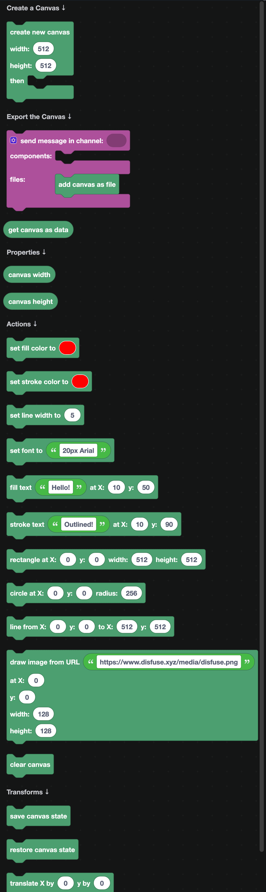

## Creating a canvas

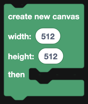

`create new canvas width ... height ... then ...` makes a blank image. Everything you draw goes inside the `then` part.

Sizes worth knowing: a Discord embed image shows well at 1000 by 300, and a square avatar card at 512 by 512.

| Block | Returns |
| --- | --- |
| 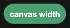 | The canvas width. |
| 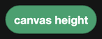 | The canvas height. |

Use these instead of typing the numbers again, so changing the size in one place changes everything.

## Coordinates

The top left corner is X 0, Y 0. X grows to the right, Y grows **downward**. A point at Y 100 is 100 pixels below the top, not above the bottom.

## Setting up a style

Drawing blocks use whatever style is currently set, so set the style first and then draw.

| Block | What it sets |
| --- | --- |
| 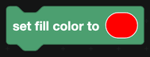 | The color used to fill shapes and text. |
| 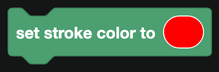 | The color used for outlines. |
| 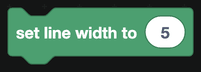 | How thick outlines are. |
| 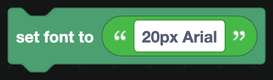 | The font, as a size and family, for example `bold 40px Arial`. |

Colors come from the [Colour](../colour.md) blocks.

## Drawing

| Block | What it draws |
| --- | --- |
| 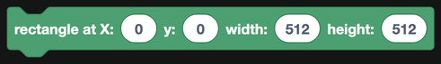 | A rectangle. |
| 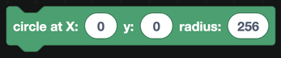 | A circle. |
| 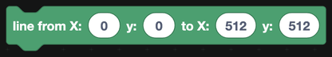 | A straight line between two points. |
| 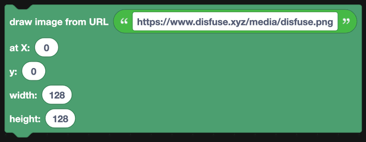 | An image from a URL, scaled to the size you give. |
| 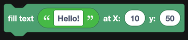 | Solid text. |
| 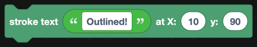 | Outlined text. |
| 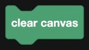 | Wipes everything back to blank. |

`draw image from URL` is how an avatar goes on a rank card. Feed it `avatar URL of user/member` from [Members](../Servers/members.md).

## Transforms

| Block | What it does |
| --- | --- |
| 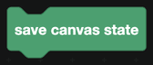 | Remembers the current style and position. |
| 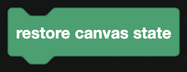 | Goes back to the last saved state. |
| 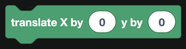 | Moves the origin, so 0,0 means somewhere else. |
| 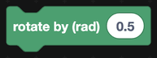 | Rotates everything drawn from now on, in radians. |

Rotation is in radians, not degrees. To rotate by 45 degrees, use `45 × π ÷ 180` with the [Math](../math.md) blocks.

Always `save` before a transform and `restore` after it. Without that, everything drawn afterwards inherits the rotation.

## Sending the image

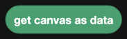

`get canvas as data` turns the canvas into something you can attach.

1. In the **files** input of a send block, put `add file` with `get canvas as data` and a name like `card.png`.
2. In the **components** input, put `show file with name: card.png`.

See [File display](../Components/file-display.md).

## A worked example: a rank card

1. `create new canvas width 934 height 282`.
2. Set the fill color to a dark gray and draw a rectangle over the whole canvas.
3. `draw image from URL <avatar URL of member>` at X 40, Y 40, 200 by 200.
4. Set the font to `bold 48px Arial`, fill color white, and `fill text <username>` at X 280, Y 110.
5. Draw a gray rectangle for the XP bar background, then a colored one on top whose width is `current XP ÷ needed XP × 500`.
6. Send it as a file.

:::tip
Getting a layout right takes several tries. Build it once, send it to a private channel, and adjust the numbers until it looks right.
:::
