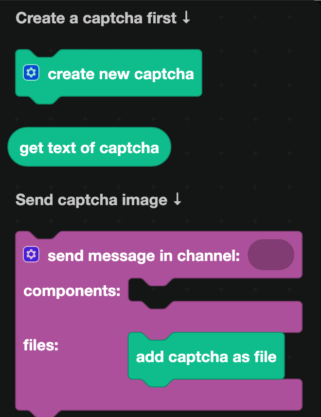

# Captcha

A captcha is an image of distorted text that a person can read and a script cannot. These blocks generate one, so you can ask a new member to type what it says before letting them into the server.

## The blocks

`create new captcha` generates one. Click the gear on the block to change the size, the text, and the difficulty.

`get text of captcha` is the answer, as text. Compare what the user typed against this.

## Sending the image

The captcha is a file, so it goes in the **files** input of a send block:

1. `add file` from [File display](../Components/file-display.md), with the captcha plugged in and a name like `captcha.png`.
2. `show file with name: captcha.png` in the **components** input.

## Collecting the answer

Two ways, and the second is better.

**In a channel.** Use `wait for responses in channel` from [Channels](../Servers/channels.md) with a filter that only accepts messages from the person being verified. It works, but the answer is visible to everyone in the channel.

**In a modal.** Send the captcha with a button. When it is clicked, show a [modal](../../Interactions/modals.md) with a text input. The answer is private, and only the person who clicked can submit it.

## Comparing the answer

Use `exactly equals` from [Logic](../logic.md) if the captcha is case sensitive, or put both sides through `to UPPER CASE` from [Text](../text.md) first if you would rather not be strict about it.

## A worked example: verification

1. `when a member joins a server`.
2. Send a DM with a container explaining what to do and a button with the ID `verify_start`.
3. When that button is clicked:
   - `create new captcha`.
   - Store `get text of captcha` in a [database](../Databases/simple.md) under the user's ID.
   - `reply to the interaction`, visible only to the user, with the captcha image and a second button, `verify_answer`.
4. When `verify_answer` is clicked, show a modal with a text input.
5. When the modal is submitted, compare the input against what you stored. On a match, `add role to member` with your Verified role and delete the stored answer.

:::tip
Give people a limited number of attempts, and store the count in the database alongside the answer. Without a limit, a script can simply guess.
:::
