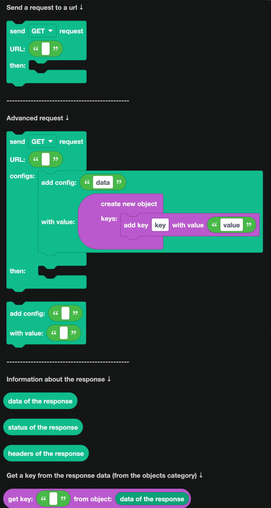
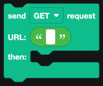
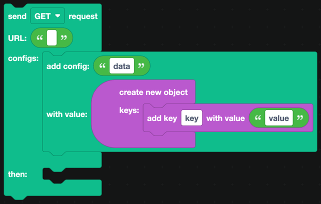
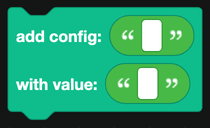

# Fetch

Fetch sends a request to a web address and gives you back what it says. It is how your bot uses any API that does not have blocks of its own.

## A simple request

`send GET request URL ... then ...` fetches a URL. Blocks in the `then` part run once the response arrives.

The dropdown also offers POST, PUT, PATCH and DELETE.

## An advanced request

`send GET request URL ... configs ... then ...` is the same, with room for extra settings.

`add config ... with value ...` sets one of them. The ones you will need:

| Config | What it is |
| --- | --- |
| `data` | The body to send, usually an object, for POST and PUT requests. |
| `headers` | An object of headers, which is where an API key goes. |
| `params` | An object of query string values. |
| `timeout` | How long to wait, in milliseconds. |

Build the value with the [Objects](../objects.md) blocks.

## Reading the response

| Block | Returns |
| --- | --- |
|  | The body, as an object when the response is JSON. |
|  | The HTTP status code. 200 means it worked. |
|  | The response headers, as an object. |

`get key ... from object ...` from [Objects](../objects.md) pulls one value out of the response data. Chain them to reach into nested data.

## API keys

An API key belongs in a [secret](../../Guide/secrets.md), never typed into a block.

1. Add a secret named `WEATHER_KEY` with the key as its value.
2. Build a headers object with `Authorization` set to `get secret with name WEATHER_KEY`.
3. Pass that object as the `headers` config.

## Checking the status

Always check the status before using the data:

1. `if` `status of the response` equals 200, read the data.
2. `else`, reply with something useful and log the status.

A 401 means the key is wrong, 404 means the address is wrong, 429 means you are asking too often, and anything starting with 5 means the other service has a problem.

## Rate limits

Most APIs cap how often you can ask. Two things help:

- Add a [cooldown](../cooldowns.md) to any command that fetches, so one person cannot exhaust your quota.
- Cache the answer in a [database](../Databases/simple.md) with a timestamp, and only fetch again when it is stale.

## A worked example: a weather command

1. A slash command `weather` with a text option `city`.
2. `defer reply`.
3. `send GET request` to the weather API, with the city in the URL and the key in a header.
4. In the `then` part:
   - `if` the status is 200, `get key temp from` `get key main from` `data of the response`.
   - `edit the bot's reply` with a container showing the city and the temperature.
   - `else`, edit the reply with "Could not find that city."
