# GitHub

Blocks for GitHub: read public users, organizations, repositories, issues, pull requests, commits, releases and gists, and, with a token, act as your own account to open issues, comment, merge, publish releases and more.

  
Show the whole GitHub flyout

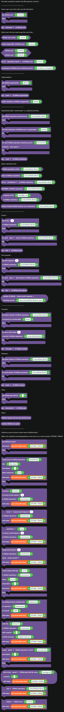

## Tokens and rate limits

Reading public information needs no token. GitHub allows **60 requests an hour** without one, shared by everything your bot does.

The blocks under **Actions as your account** need a token. Make one at [github.com/settings/tokens](https://github.com/settings/tokens) and save it as a [secret](../../Guide/secrets.md) named `GITHUB_TOKEN`. The blocks come with `get secret with name GITHUB_TOKEN` already plugged in. Never paste a token straight into a text block: anyone who sees your project would see it.

| Block | Returns |
| --- | --- |
|  | How many requests the bot has left this hour. Checking does not use one up. |
|  | A random piece of design wisdom from GitHub. |

## The "get, then info" pattern

Most things work in two steps, the same as [Roblox](roblox.md): a `get ... then` block looks something up, and inside its `then` part an info block reads from it.

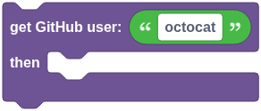

The info blocks only work inside their own `get` block, or inside a `for each` loop of the same kind.

## Users

`get GitHub user` works for organizations too. `get ... of GitHub user` reads the username, display name, bio, ID, account type, company, location, website, public email, X username, follower and repository counts, join date, avatar and profile link.

| Block | Returns |
| --- | --- |
|  | True when the username is taken. |
|  | A link to the avatar image. |
| 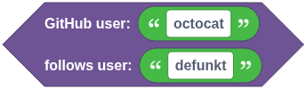 | True when one user follows another. |
|  | A list about the user: repository names, followers, following, starred repositories, organizations or gist IDs (up to 100). |
|  | Usernames matching a search, like `location:Berlin` (up to 30). |

## Organizations

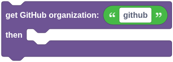

`public members of GitHub organization` gives a list of usernames (up to 100).

## Repositories

A repository is written as `owner/name`, like `octocat/Hello-World`. A full `github.com` link works too.

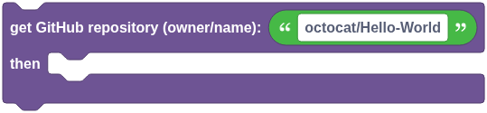

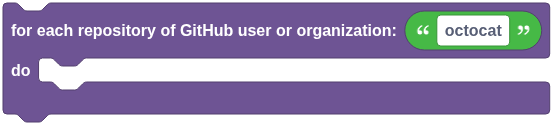

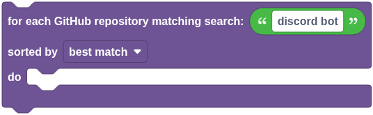

`for each repository` loops over a user's or organization's public repositories (up to 100). `for each GitHub repository matching search` searches all of GitHub (up to 30). Use the repository info block inside either loop.

### Quick repository info

| Block | Returns |
| --- | --- |
|  | True when a public repository exists. |
|  | How many stars it has. |
|  | A list about the repository: contributors, stargazers, branches, tags, languages, labels, release tags or forks (up to 100). |
|  | The text of its README. |
| 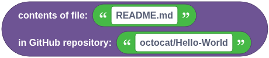 | The text of any file on the default branch, like `src/index.js`. |
|  | The result of the latest GitHub Actions run: `success`, `failure`, `cancelled`, `in_progress`, `queued`… |

## Issues and pull requests

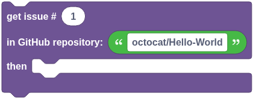

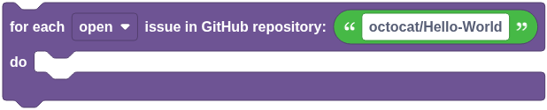

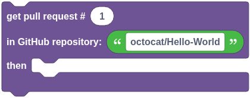

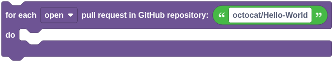

`for each open issue` leaves pull requests out; the dropdown can switch it to closed, or open or closed.

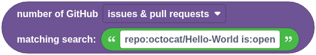

`number of GitHub issues & pull requests matching search` counts search results, like `repo:octocat/Hello-World is:issue is:open`.

## Commits, releases and gists

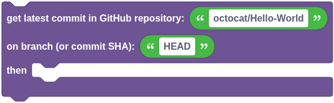

Leave the branch as `HEAD` for the default branch, or give a branch name or a commit SHA.

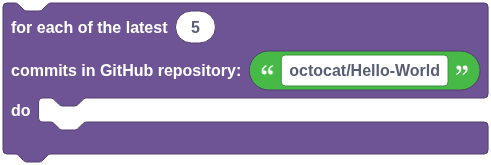

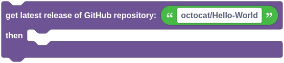

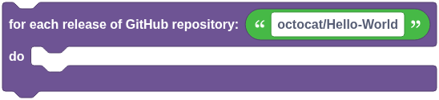

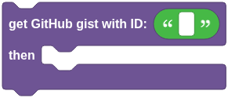

A gist's ID is the long code at the end of its link.

## Actions as your account

These all need a token, and they act as the account that token belongs to.

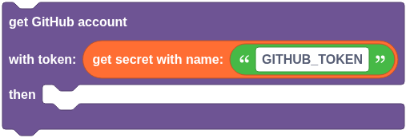

`get GitHub account with token` looks up whose token it is. Use the user info block inside.

| Block | What it does |
| --- | --- |
| 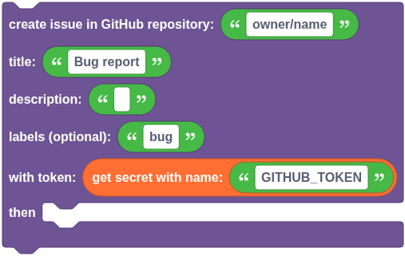 | Opens an issue, then runs its `then` part. Use the issue info block inside for its number or link. |
| 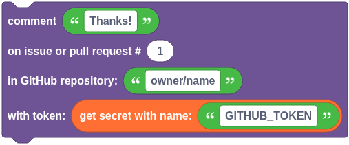 | Comments on an issue or pull request. |
| 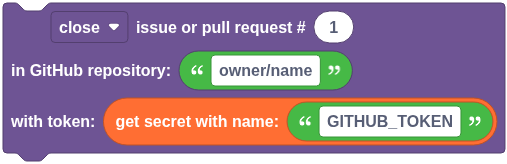 | Closes or reopens an issue or pull request. |
| 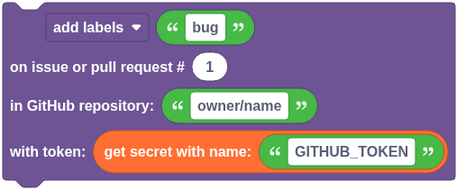 | Adds labels, removes a label, or assigns people. Give a list, or text like `bug, help wanted`. |
| 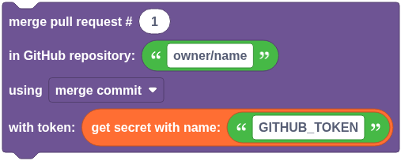 | Merges a pull request with a merge commit, squash or rebase. |
| 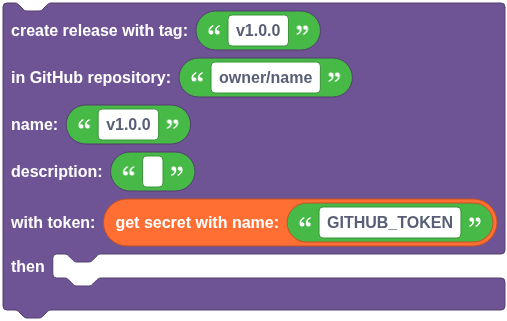 | Publishes a release, creating the tag from the default branch if needed. |
| 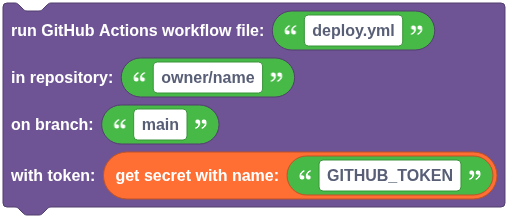 | Starts a workflow that has `workflow_dispatch` in its triggers. |
| 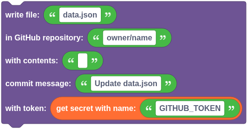 | Creates or replaces a file, as a commit on the default branch. |
| 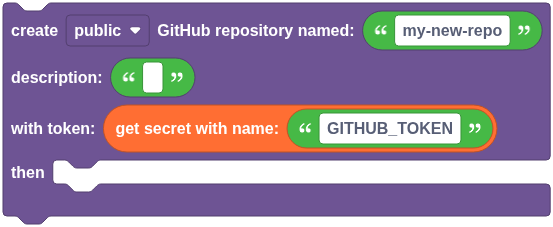 | Creates a repository on the token's account. |
| 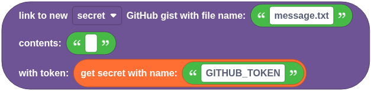 | Creates a gist with one file and gives back its link. Handy for sharing text too long for a Discord message. |
| 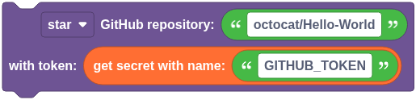 | Stars or unstars a repository. |
| 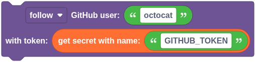 | Follows or unfollows a user. |

## A worked example: a bug report command

1. Make a `/bug` slash command with a `description` text option.
2. `defer reply`.
3. `create issue in GitHub repository` `you/your-bot`, with the title `Bug report from` and the user's name, the description from the option, and the token from `GITHUB_TOKEN`.
4. Inside its `then` part, reply with `get issue link of GitHub issue`.
