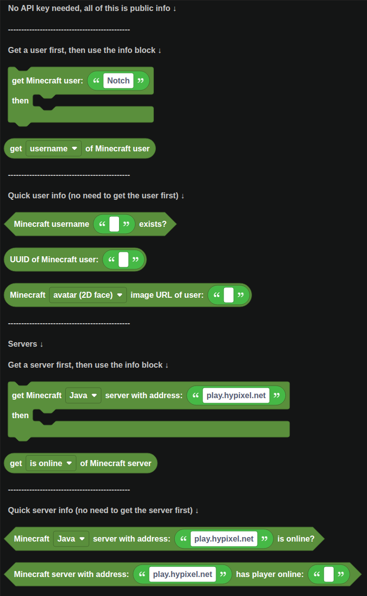
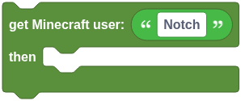

# Minecraft

Blocks for reading public Minecraft information: Java Edition accounts and the live status of any server. No API key is needed.

  
Show the whole Minecraft flyout

## Users

`get Minecraft user ... then ...` looks up a Java Edition account by username. Blocks in the `then` part run once the lookup finishes.

Inside that part, `get ... of Minecraft user` reads a property of the account: username, UUID, ID without dashes, skin and cape texture URLs, avatar and full body image URLs, or a profile link.

### Quick lookups

These do not need the user fetched first:

| Block | Returns |
| --- | --- |
|  | True when an account has that username. |
|  | The account's UUID, or null if it does not exist. |
|  | A link to an image built from the player's current skin: a 2D face, a 3D head, a 3D full body, or the flat skin. Great as an embed thumbnail. |

## Servers

`get Minecraft ... server with address ... then ...` pings a server and runs its `then` part with the result. The dropdown picks **Java** or **Bedrock**, and the address can include a port, like `play.example.com:25566`.

`get ... of Minecraft server` reads the result: whether it is online, the player count, the maximum players, the MOTD, the list of online player names, the version, the hostname, IP and port, and the server icon.

### Quick checks

| Block | Returns |
| --- | --- |
|  | True when the server answers. |
|  | True when a player with that name is in the server's player list. |

Not every server shares its player list in its status ping. On those, `has player online` says false even while the player is on.

## A worked example: a server status command

1. Make a `/status` slash command.
2. `defer reply`, because the ping can take a second.
3. `get Minecraft Java server with address` `play.example.com` `then`:
4. If `get is online of Minecraft server` is true, reply with an embed showing the player count and MOTD. Otherwise reply "The server is offline".
