# Roblox

Blocks for reading public Roblox information: users, groups, games, gamepasses and badges. No API key is needed, because all of it is public.

  
Show the whole Roblox flyout

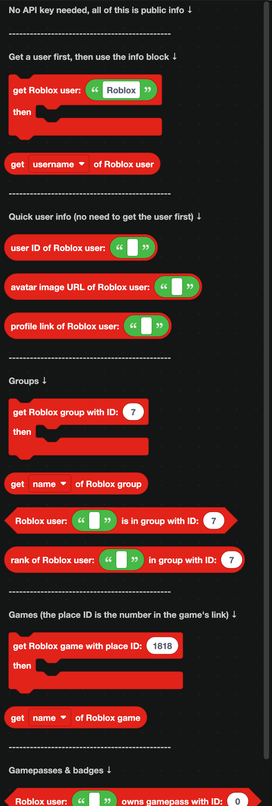

## Users

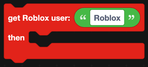

`get Roblox user ... then ...` looks a user up. Blocks in the `then` part run once the lookup finishes.

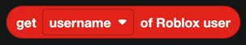

Inside that part, `get ... of Roblox user` reads a property. The dropdown offers username, display name, description, ID, creation date, and whether the account is banned.

### Quick lookups

These three do not need the user fetched first:

| Block | Returns |
| --- | --- |
| 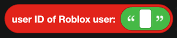 | The numeric user ID. |
| 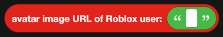 | A URL to the avatar image. |
| 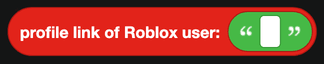 | A link to the profile page. |

## Groups

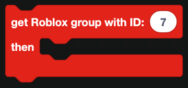

`get Roblox group with ID ... then ...` fetches a group.

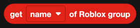

`get ... of Roblox group` reads a property: name, description, member count, owner and so on.

| Block | Returns |
| --- | --- |
| 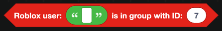 | True when a user is a member of a group. |
| 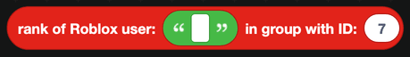 | The user's rank name in that group. |

These two are what a Roblox verification bot is built from: check the group, then give a Discord role to match.

## Games

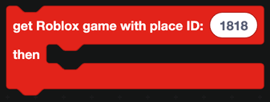

`get Roblox game with place ID ... then ...` fetches a game. The place ID is the number in the game's URL.

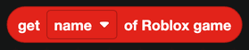

`get ... of Roblox game` reads a property: name, description, visits, players online, favorites and more.

## Gamepasses and badges

| Block | Returns |
| --- | --- |
| 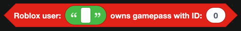 | True when a user owns a gamepass. |
| 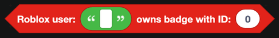 | True when a user owns a badge. |

Both take an ID, which you can find in the item's URL on the Roblox site.

## Verification

These blocks read public data. They do **not** prove that the Discord user in front of you owns the Roblox account they typed in.

The usual way to prove it is to give the person a short code, ask them to put it in their Roblox profile description, then read the description back with `get description of Roblox user` and check the code is there.

## Notes

- Every block here goes over the network, so `defer reply` first inside an interaction.
- Roblox rate limits requests. Add a [cooldown](../cooldowns.md) to commands that use these blocks.
- Wrap them in a `try` block from [JavaScript](../javascript.md), so a misspelled username gives a friendly reply instead of a failure.

## A worked example: a Roblox group role

1. A slash command `verify` with a text option `roblox_username`.
2. `defer reply`.
3. `Roblox user <option> is in group with ID <your group ID>`.
4. If true, `add role to member` with your Verified role, and reply with a confirmation.
5. If false, reply telling them to join the group first.
