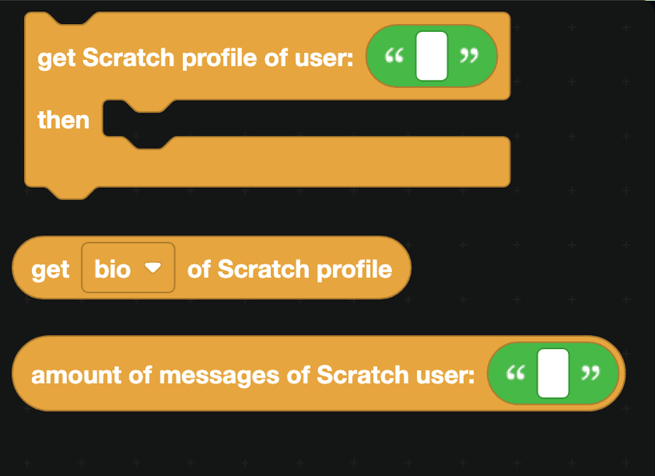
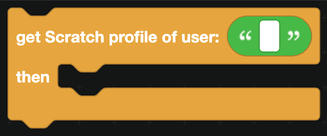
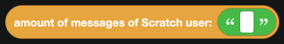

# Scratch

Three blocks for reading public information from [Scratch](https://scratch.mit.edu) profiles.

## Getting a profile

`get Scratch profile of user ... then ...` looks a profile up. Blocks in the `then` part run once it arrives.

Inside that part, `get ... of Scratch profile` reads a property. The dropdown offers the bio, what the user is working on, their user ID, their join date, their country, and their avatar URL.

## Message count

`amount of messages of Scratch user` returns how many unread messages that account has. This is public on Scratch, which is why it can be read without logging in.

## Verification

The same trick as Roblox works here. To prove somebody owns a Scratch account:

1. Give them a short random code.
2. Ask them to put it in their "What I'm working on" section.
3. Read it back with `get what the user is working on of Scratch profile` and check the code matches.

## Notes

- Only public information is available. There is no login, and no way to post as a Scratch user.
- The blocks go over the network. `defer reply` before them inside an interaction, and wrap them in a `try` block from [JavaScript](../javascript.md).
- A username that does not exist will make the block fail rather than return nothing, so the try block matters.

## A worked example: a profile command

1. A slash command `scratch` with a text option `username`.
2. `defer reply`.
3. `get Scratch profile of user <option>`.
4. In the `then` part, `edit the bot's reply` with a container holding:
   - a section with thumbnail, using `get avatar URL of Scratch profile`
   - text displays with the bio and the join date
5. Add a link button to `https://scratch.mit.edu/users/<username>` so people can open the real profile.
