# WebSockets

WebSockets keep a live connection open, so both sides can send messages at any time. They are what chats, live dashboards, games and real-time APIs are built on.

The WebSockets subcategory has two halves:

| Half | Use it when |
| --- | --- |
| **Frontend (client)** | Your bot connects to someone else's server, like a live API or a game server. |
| **Backend (server)** | Your bot runs its own server that websites and apps connect to. |

Each half offers two libraries, and they do not mix:

| Library | What it is |
| --- | --- |
| **WebSocket (ws)** | The plain, built-in kind. Links start with `ws://` or `wss://`. |
| **Socket.IO** | Adds named events, rooms and replies on top, but only talks to other Socket.IO apps. |

Pick whichever one the other side uses. If you are building both sides yourself, Socket.IO is usually easier.

## Names

Every connection and every server has a name, `main` by default. All the other blocks take that name, so one bot can hold several connections or run several servers at once: just give each a different name and use it everywhere.

## Events

Both libraries can send **events**: a name plus some data. Socket.IO has them built in. For plain WebSockets, DisFuse sends events as JSON shaped like `{ "event": "chat", "data": ... }`, and the `when ... receives event` blocks read that same shape, so a DisFuse client and a DisFuse server understand each other.

## Hosting a server

A server block opens a port on the machine your bot runs on. Your host has to allow that and tell you which port to use. See [Hosting](../../Help/hosting.md).

## Client: WebSocket (ws)

  
Show the whole flyout

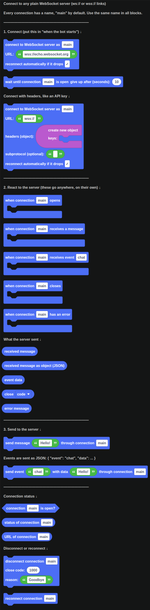

Connect to any plain WebSocket server (ws:// or wss:// links)

Every connection has a name, "main" by default. Use the same name in all blocks.

### Connect

| Block | What it does |
| --- | --- |
| 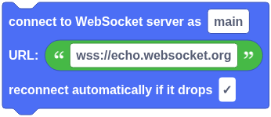 | Opens a WebSocket connection to a server (the URL starts with ws:// or wss://). The name lets other blocks use this connection. Put "when connection … receives a message" blocks anywhere to react to it. |
|  | Pauses until the connection has finished opening, or until the time runs out. Handy right after connecting, before sending something. |

### Connect with headers, like an API key

| Block | What it does |
| --- | --- |
| 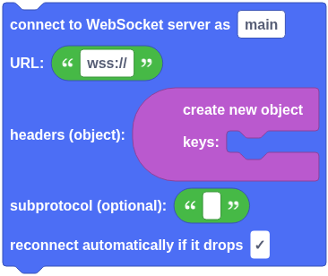 | Opens a WebSocket connection and sends extra headers with it, like an Authorization header with an API key. Leave the subprotocol empty unless the API asks for one. |

### React to the server

| Block | What it does |
| --- | --- |
| 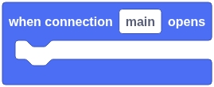 | Runs every time the connection opens, including after it reconnects. A good place to log in or subscribe to things. |
| 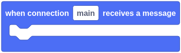 | Runs every time the server sends a message |
| 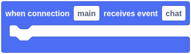 | Runs when the server sends JSON like `{ "event": "chat", "data": ... }` with this event name. Use "event data" inside it. |
| 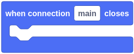 | Runs when the connection closes, whether you closed it or the server did |
| 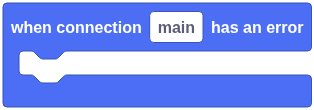 | Runs when something goes wrong, like the server being unreachable. Without this block, errors are printed to the console. |

### What the server sent

| Block | What it does |
| --- | --- |
|  | The message the server sent, as text |
|  | The message the server sent, read as JSON. Use the Objects blocks to get keys from it. Empty if the message isn't JSON. |
|  | The "data" part of the event the server sent. It can be text, a number, an object or a list. |
|  | Why the connection closed. Code 1000 is a normal close, 1006 means it dropped without a goodbye. |
|  | What went wrong, as text |

### Send to the server

| Block | What it does |
| --- | --- |
|  | Sends a message to the server. Text is sent as it is; objects and lists are sent as JSON. If the connection is still opening, the message is sent as soon as it opens. |

Events are sent as JSON: `{ "event": "chat", "data": ... }`

| Block | What it does |
| --- | --- |
|  | Sends `{ "event": name, "data": data }` as JSON. Use this with servers that expect events in that shape — including DisFuse WebSocket servers. |

### Connection status

| Block | What it does |
| --- | --- |
|  | True if the connection is open and ready to send messages |
|  | The connection's status as text: "connecting", "open", "closing" or "closed" |
|  | The URL this connection was opened to |

### Disconnect or reconnect

| Block | What it does |
| --- | --- |
| 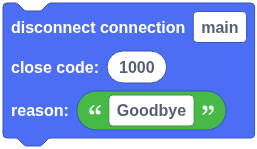 | Closes the connection. It won't reconnect by itself after this. Close code 1000 means a normal close. Custom codes must be between 3000 and 4999. |
|  | Closes the connection (if it's open) and connects again to the same URL, with the same settings |

## Client: Socket.IO

  
Show the whole flyout

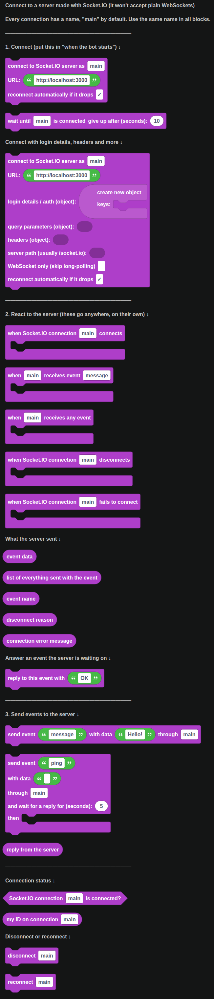

Connect to a server made with Socket.IO (it won't accept plain WebSockets)

Every connection has a name, "main" by default. Use the same name in all blocks.

### Connect

| Block | What it does |
| --- | --- |
| 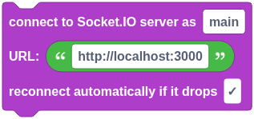 | Connects to a Socket.IO server. The URL usually starts with https:// or http:// — add a path like /chat to the end to join that namespace. The name lets other blocks use this connection. |
|  | Pauses until the connection is ready, or until the time runs out |

### Connect with login details, headers and more

| Block | What it does |
| --- | --- |
| 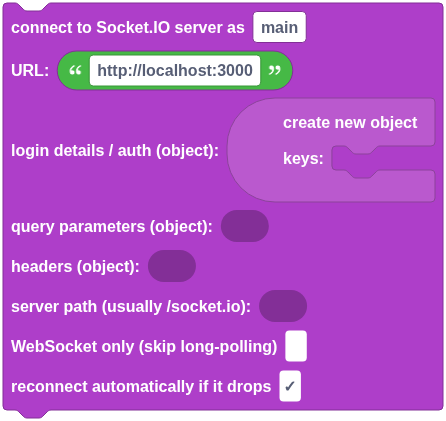 | Connects to a Socket.IO server with extra settings. Leave anything you don't need empty. Login details are what a DisFuse Socket.IO server reads with "login detail … of this client". |

### React to the server

| Block | What it does |
| --- | --- |
| 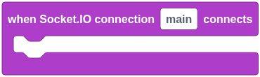 | Runs every time the connection is made, including after reconnecting |
| 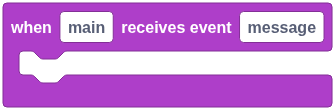 | Runs when the server sends an event with this name. Use "event data" inside it. |
| 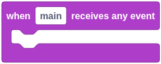 | Runs for every event the server sends, whatever its name. Use "event name" to see which one it was. |
| 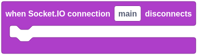 | Runs when the connection is lost or closed |
| 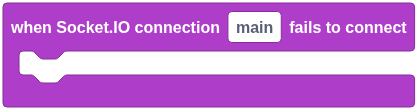 | Runs when connecting fails, like when the server is down or rejects the login. Without this block, errors are printed to the console. |

### What the server sent

| Block | What it does |
| --- | --- |
|  | The data the server sent with the event. It can be text, a number, an object or a list. |
|  | Some servers send more than one value with an event. This is all of them, as a list. "event data" is the first one. |
|  | The name of the event the server sent |
|  | Why it disconnected, like "io server disconnect" (the server kicked it) or "transport close" (the connection dropped) |
|  | Why it couldn't connect, as text |

### Answer an event the server is waiting on

| Block | What it does |
| --- | --- |
|  | Answers the event the server sent, if the server is waiting for an answer. Only the first reply is sent. |

### Send events to the server

| Block | What it does |
| --- | --- |
|  | Sends an event to the server. The data can be text, a number, an object or a list. If it isn't connected yet, it's sent as soon as it connects. |
| 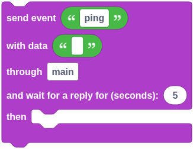 | Sends an event and waits for the server to answer it. Use "reply from the server" inside — it's empty if no answer came in time. |
|  | What the server answered with. Empty if it didn't answer in time. |

### Connection status

| Block | What it does |
| --- | --- |
|  | True if the connection is open right now |
|  | The ID the server gave this connection. It changes every time it reconnects. |

### Disconnect or reconnect

| Block | What it does |
| --- | --- |
|  | Closes the connection. It won't reconnect by itself after this. |
|  | Connects again after the connection was closed with "disconnect" |

### Run your own server that websites and apps connect to

Your host must let you open a port for others to reach it

## Server: WebSocket (ws)

  
Show the whole flyout

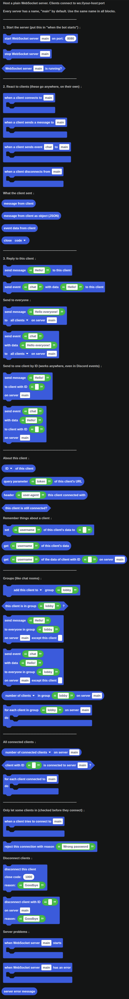

Host a plain WebSocket server. Clients connect to `ws://your-host:port`

Every server has a name, "main" by default. Use the same name in all blocks.

### Start the server

| Block | What it does |
| --- | --- |
|  | Starts a WebSocket server that apps and websites can connect to with `ws://your-host:port`. Most hosts tell you which port you're allowed to use. Put this in "when the bot starts". |
|  | Disconnects every client and stops the server |
|  | True if the server has been started and not stopped |

### React to clients

| Block | What it does |
| --- | --- |
| 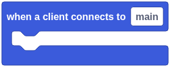 | Runs every time a new client connects to the server |
| 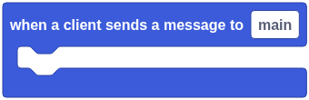 | Runs every time any client sends the server a message |
| 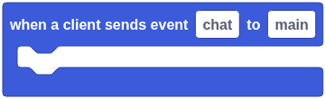 | Runs when a client sends JSON like `{ "event": "chat", "data": ... }` with this event name. Use "event data" inside it. |
| 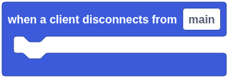 | Runs when a client leaves, for any reason. You can still read its ID and data, but can't send to it anymore. |

### What the client sent

| Block | What it does |
| --- | --- |
|  | The message the client sent, as text |
|  | The message the client sent, read as JSON. Use the Objects blocks to get keys from it. Empty if the message isn't JSON. |
|  | The "data" part of the event the client sent. It can be text, a number, an object or a list. |
|  | Why the client left. Code 1000 or 1001 is a normal close, 1006 means it dropped without a goodbye. |

### Reply to this client

| Block | What it does |
| --- | --- |
|  | Sends a message to this client only. Text is sent as it is; objects and lists are sent as JSON. |
|  | Sends `{ "event": name, "data": data }` as JSON to this client only |

### Send to everyone

| Block | What it does |
| --- | --- |
| 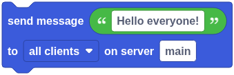 | Sends a message to everyone connected. "all clients except this one" only works inside a "when a client…" block. |
| 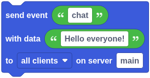 | Sends an event to everyone connected. "all clients except this one" only works inside a "when a client…" block. |

### Send to one client by ID

| Block | What it does |
| --- | --- |
| 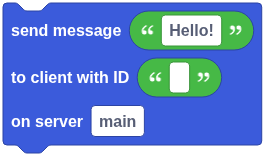 | Sends a message to one client, found by its ID. Works anywhere. |
| 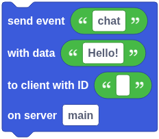 | Sends an event to one client, found by its ID. Works anywhere. |

### About this client

| Block | What it does |
| --- | --- |
|  | Information about this client. The ID is unique and can be saved and used later with "send to client with ID". |
|  | A value from the end of the URL the client connected with. For `ws://host:8080/?token=abc`, the parameter "token" is "abc". |
|  | A header the client sent when it connected, like "user-agent" or "authorization" |
|  | True if this client hasn't disconnected yet |

### Remember things about a client

| Block | What it does |
| --- | --- |
|  | Remembers something about this client for as long as it's connected, like its username after it logs in |
|  | Something you saved about this client with "set … of this client's data" |
|  | Something you saved about a client, found by its ID. Works anywhere. |

### Groups (like chat rooms)

| Block | What it does |
| --- | --- |
|  | Groups are like chat rooms: put clients in one, then send a message to everyone in it at once. A client can be in many groups. |
|  | True if this client has been added to the group |
| 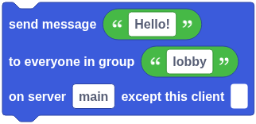 | Sends a message to every client in the group. Tick "except this client" to skip the one that sent it (only inside a "when a client…" block). |
| 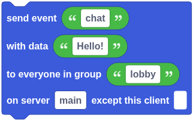 | Sends an event to every client in the group |
|  | Who is in a group right now |
| 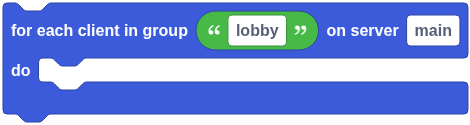 | Runs the blocks inside once for every client in the group. Inside, "this client" means the one the loop is on. |

### All connected clients

| Block | What it does |
| --- | --- |
|  | Everyone connected to the server right now |
|  | True if a client with this ID is connected right now |
| 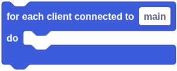 | Runs the blocks inside once for every connected client. Inside, "this client" means the one the loop is on. |

### Only let some clients in

| Block | What it does |
| --- | --- |
|  | Runs before a client is let in. Check things like a password in the URL (with "query parameter") and use "reject this connection" to turn them away. Anything saved to the client's data here is kept once they connect. |
|  | Turns the client away before it connects, and stops the blocks after it. Only letters, numbers and punctuation are sent in the reason. |

### Disconnect clients

| Block | What it does |
| --- | --- |
| 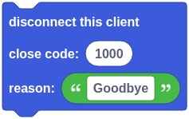 | Closes this client's connection. Close code 1000 means a normal close. Custom codes must be between 3000 and 4999. |
| 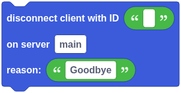 | Closes one client's connection, found by its ID. Works anywhere. |

### Server problems

| Block | What it does |
| --- | --- |
| 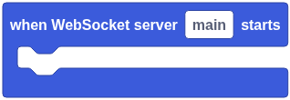 | Runs once the server is up and ready for connections |
| 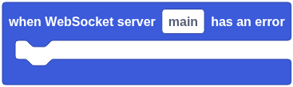 | Runs when the server itself has a problem, like the port already being in use. Without this block, errors are printed to the console. |
|  | What went wrong, as text |

## Server: Socket.IO

  
Show the whole flyout

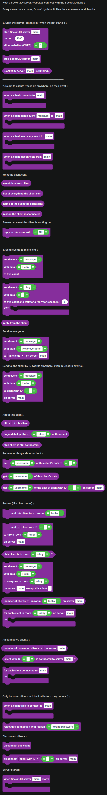

Host a Socket.IO server. Websites connect with the Socket.IO library

Every server has a name, "main" by default. Use the same name in all blocks.

### Start the server

| Block | What it does |
| --- | --- |
| 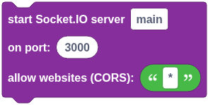 | Starts a Socket.IO server that apps and websites can connect to. "Allow websites" is which websites may connect from a browser: * for any, or a list like https://mysite.com, https://other.com. Put this in "when the bot starts". |
|  | Disconnects every client and stops the server |
|  | True if the server has been started and not stopped |

### React to clients

| Block | What it does |
| --- | --- |
| 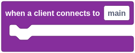 | Runs every time a new client connects to the server |
| 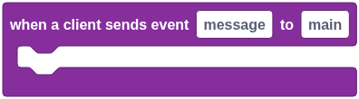 | Runs when any client sends an event with this name. Use "event data" inside it, and "reply to this event" if the client is waiting for an answer. |
| 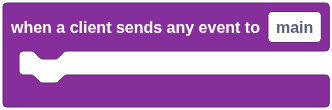 | Runs for every event any client sends, whatever its name. Use "event name" to see which one it was. |
| 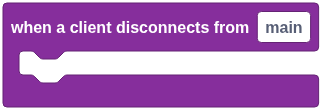 | Runs when a client leaves, for any reason. You can still read its ID and data here. |

### What the client sent

| Block | What it does |
| --- | --- |
|  | The data the client sent with the event. It can be text, a number, an object or a list. |
|  | A client can send more than one value with an event. This is all of them, as a list. "event data" is the first one. |
|  | Which event the client sent |
|  | Like "client namespace disconnect" (it left on purpose), "transport close" (the connection dropped) or "server namespace disconnect" (you kicked it) |

### Answer an event the client is waiting on

| Block | What it does |
| --- | --- |
|  | Answers the event the client sent, if the client is waiting for an answer ("send event … and wait for a reply"). Only the first reply is sent. |

### Send events to this client

| Block | What it does |
| --- | --- |
| 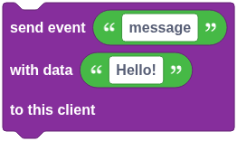 | Sends an event to this client only |
| 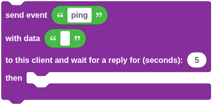 | Sends an event to this client and waits for it to answer. Use "reply from the client" inside — it's empty if no answer came in time. |
|  | What the client answered with. Empty if it didn't answer in time. |

### Send to everyone

| Block | What it does |
| --- | --- |
| 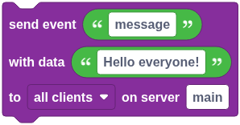 | Sends an event to everyone connected. "all clients except this one" only skips someone inside a "when a client…" block. |

### Send to one client by ID

| Block | What it does |
| --- | --- |
| 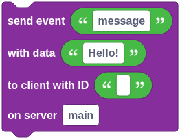 | Sends an event to one client, found by its ID. Works anywhere. |

### About this client

| Block | What it does |
| --- | --- |
|  | Information about this client. The ID can be saved and used later with "send event to client with ID". |
|  | Something the client sent when it connected: its login details (the auth object), a value from its URL, or a header like user-agent |
|  | True if this client hasn't disconnected yet |

### Remember things about a client

| Block | What it does |
| --- | --- |
|  | Remembers something about this client for as long as it's connected, like its username after it logs in |
|  | Something you saved about this client with "set … of this client's data" |
|  | Something you saved about a client, found by its ID. Works anywhere. |

### Rooms (like chat rooms)

| Block | What it does |
| --- | --- |
|  | Rooms are like chat rooms: put clients in one, then send an event to everyone in it at once. A client can be in many rooms. |
| 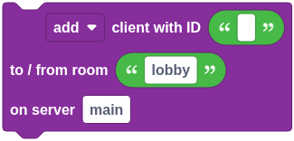 | Moves a client in or out of a room, found by its ID. Works anywhere. |
|  | True if this client is in the room |
| 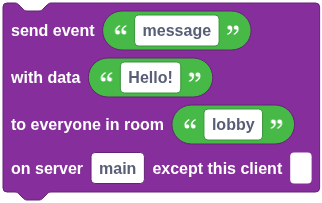 | Sends an event to every client in the room. Tick "except this client" to skip the one that sent it (only inside a "when a client…" block). |
|  | Who is in a room right now |
| 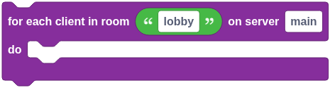 | Runs the blocks inside once for every client in the room. Inside, "this client" means the one the loop is on. |

### All connected clients

| Block | What it does |
| --- | --- |
|  | Everyone connected to the server right now |
|  | True if a client with this ID is connected right now |
| 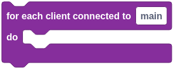 | Runs the blocks inside once for every connected client. Inside, "this client" means the one the loop is on. |

### Only let some clients in

| Block | What it does |
| --- | --- |
| 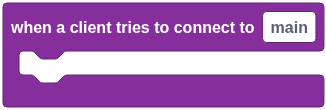 | Runs before a client is let in. Check its login details and use "reject this connection" to turn it away. You can also save client data or join rooms here. |
|  | Turns the client away before it connects, and stops the blocks after it. The client sees the reason in its "fails to connect" event. |

### Disconnect clients

| Block | What it does |
| --- | --- |
|  | Closes this client's connection. It won't reconnect by itself. |
|  | Closes the connection of one client (by ID) or of everyone in a room. Works anywhere. |

### Server started

| Block | What it does |
| --- | --- |
|  | Runs once the server is up and ready for connections |

## A worked example: a live Discord feed for a website

1. In `when the bot starts`, `start Socket.IO server` `main` on the port your host gives you.
2. In `when a message is received`, `send event` `message` with the message content as data `to all clients on server main`.
3. On your website, connect with the Socket.IO library and listen for `message`. Every Discord message now shows up live on the page.
