# Buttons

Buttons are the simplest way for someone to interact with your bot. No typing, no command names, just a click.

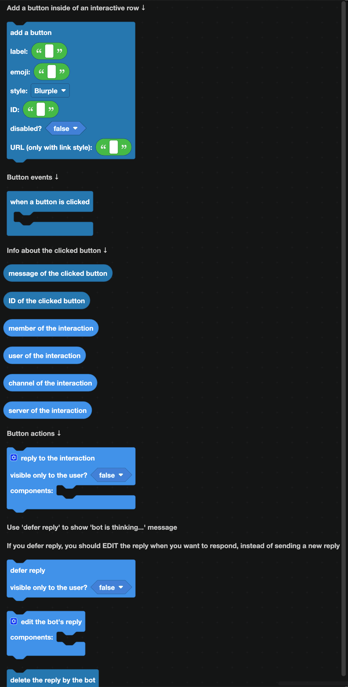

## Adding a button

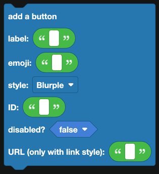

Goes inside an [interactive row](layout.md), or use a [section with button](sections.md) to put one beside some text.

| Field | What it is |
| --- | --- |
| Label | The text on the button. |
| Emoji | An optional emoji. Use a standard emoji, or the full custom emoji form. |
| Style | Blurple, Gray, Green, Red, or Link. |
| ID | The custom ID. This is how your code recognizes which button was clicked. |
| Disabled | When true, the button is grayed out and cannot be clicked. |
| URL | Only used with the Link style. Link buttons open a page and never reach your bot. |

:::tip
Custom IDs have to be unique within a message, and they are how you tell buttons apart. Use descriptive ones like `ticket_close` rather than `button1`. If you need to remember which item a button belongs to, put the ID in the custom ID, for example `giveaway_enter_12345`.
:::

## Responding to a click

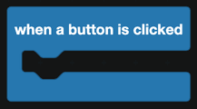

`when a button is clicked` fires for **every** button on your bot, so the first thing inside it is nearly always an `if` that checks which one.

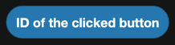

`ID of the clicked button` gives you the custom ID you set.

## What you get from the click

| Block | Returns |
| --- | --- |
| 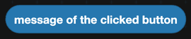 | The message the button is on. |
| 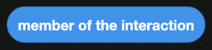 | The member who clicked, inside that server. |
| 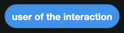 | The user who clicked. |
| 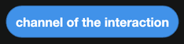 | The channel the message is in. |
| 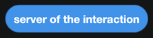 | The server it happened in. |

## Replying

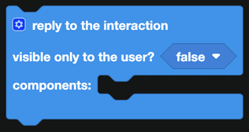

`reply to the interaction` answers the click. Set **visible only to the user** to true for a reply nobody else can see, which is what you want for confirmations and error messages.

:::warning
Discord gives you 3 seconds to respond to a click. If your bot does not reply in that time, the user sees "This interaction failed".
:::

### Slow work: defer first

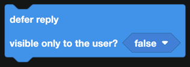

If the click starts something slow, such as a web request or a long database read, use `defer reply` immediately. Discord shows "the bot is thinking..." and gives you up to 15 minutes.

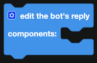

After deferring, use `edit the bot's reply` to fill in the answer. Do not send a second reply, or the user gets two messages.

### Deleting the reply

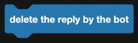

`delete the reply by the bot` removes the reply you sent.

## A worked example: a confirm button

1. Send a message with a text display asking "Are you sure?" and an interactive row holding a red button labeled "Delete" with the ID `confirm_delete`.
2. In `when a button is clicked`, check that `ID of the clicked button` equals `confirm_delete`.
3. Check that `user of the interaction` is the person who ran the original command, so nobody else can press it.
4. Do the work, then `reply to the interaction` with "Done", visible only to the user.
