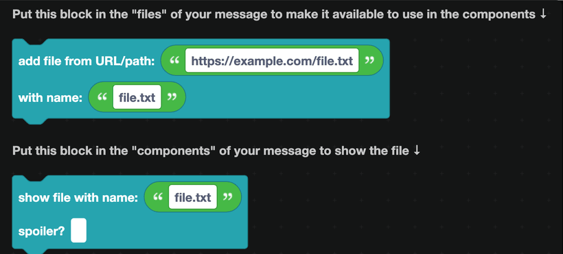
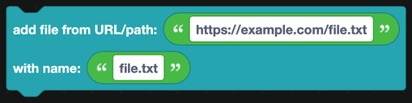
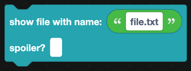

# File display

Attaching a file to a message takes two blocks: one that attaches it, and one that shows it.

## Add file

Goes in the **files** input of a send block, not the components input.

| Field | What it is |
| --- | --- |
| URL or path | Where the file comes from: a public URL, or a path on the machine running your bot. |
| Name | The filename people will see, and the name you use to reference it. |

This block can also take a Canvas or a Captcha rather than a URL, by plugging in `get canvas as data` from [Canvas](../Apps/canvas.md) or the equivalent Captcha block.

## Show file

Goes in the **components** input, where you want the file to appear in the message. Give it the same name you used on the `add file` block.

The spoiler option blurs the file until the viewer clicks it.

## The two inputs

Send blocks have both inputs for a reason:

- **files** is the attachment list. Files here are uploaded with the message.
- **components** is what people see. A `show file` component draws an attached file at that point in the layout.

Attaching a file without a `show file` component still attaches it, and Discord shows it at the bottom of the message in its default position. Adding the component gives you control over where it lands.

## Example: sending a generated image

1. Build the image with the [Canvas](../Apps/canvas.md) blocks.
2. In the **files** input of `send message in channel`, put `add file` with `get canvas as data` and the name `rank.png`.
3. In the **components** input, put a text display and then `show file with name: rank.png`.

## Notes

- Discord limits attachment size. Free servers allow 10 MB per message.
- Filenames should include the extension. Discord decides how to preview a file from it.
- To use an attached image inside a [media gallery](media.md) or a [section thumbnail](sections.md), set the image URL to `attachment://` followed by the filename.
