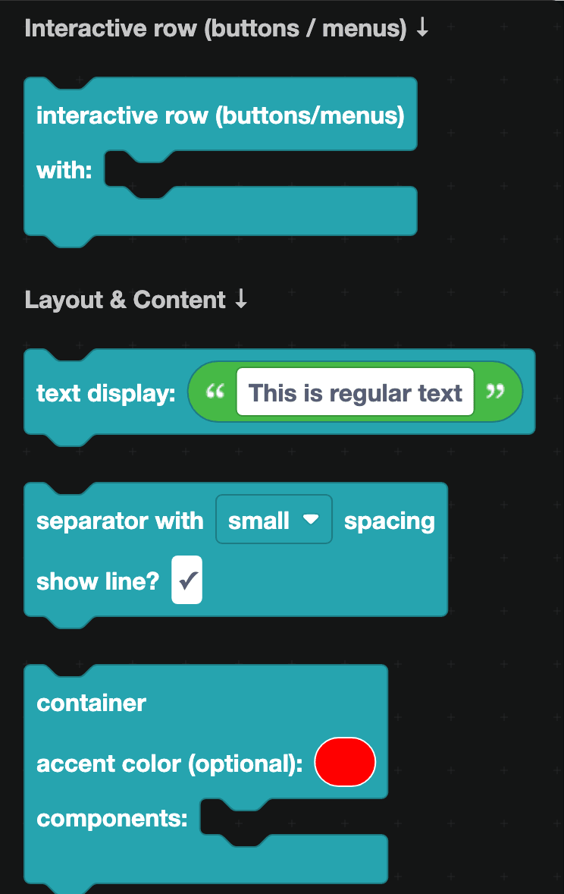
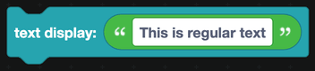
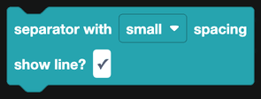
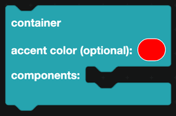
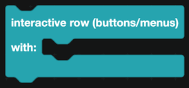

# Layout

The Layout subcategory holds the components that shape a message: plain text, dividers, containers, and the row that buttons and menus sit in.

## Text display

Regular message text. A message that is just words is a single text display and nothing else.

Text displays support all of Discord's markdown: `**bold**`, `*italic*`, `` `code` ``, `# headings`, `> quotes`, lists, and mentions like `<@userID>` and `<#channelID>`.

Unlike the old system, a text display can go anywhere. Put one above a container, below a set of buttons, or between two sections.

## Separator

A gap between components, optionally with a thin line through it. Choose small or large spacing, and whether the line is drawn.

Separators are how you give a long message some breathing room without resorting to blank text displays.

## Container

A container groups components together, draws them on a slightly different background, and puts a colored bar down the left edge. It is the closest thing to the old embed.

- **Accent color** sets the bar color. Leave it empty for no bar. Plug in any [Colour](../colour.md) block.
- **Components** holds everything inside the container: text displays, sections, galleries, separators and interactive rows.

Containers cannot be nested inside other containers.

## Interactive row

A row that holds buttons or a select menu. Put `add a button` blocks inside for up to 5 buttons, or a single `add a menu` block.

A message can have up to 5 interactive rows. Rows can go inside a container or on their own, and they can appear anywhere in the component list, not only at the bottom.

See [Buttons](buttons.md) and [Select Menus](select-menus.md) for what goes inside.

## Putting it together

A typical announcement message:

1. **Text display** with a heading, outside the container.
2. **Container**, accent color set to your brand color, holding:
   - a text display with the body
   - a separator
   - a text display with the small print
3. **Interactive row** with a link button to your website.

:::tip
Design the shape of the message first with empty text displays, then fill in the words. It is much easier to see whether a layout works before it is full of text.
:::
