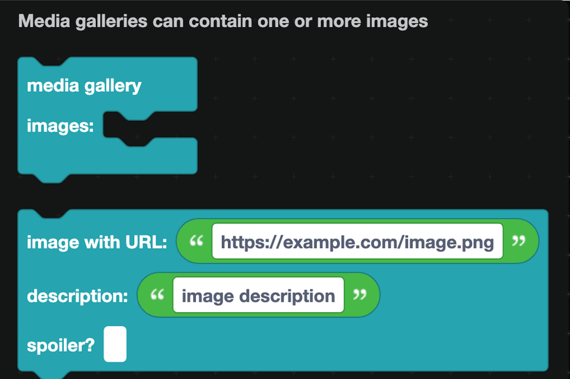
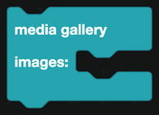
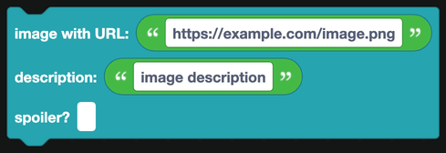

# Media

Media galleries show one or more images together, laid out as a grid.

## Media gallery

The gallery itself. Put `image with URL` blocks inside it.

One image fills the width. Two or more are arranged in a grid, the way Discord lays out multiple attachments.

## Image

One image in a gallery.

| Field | What it is |
| --- | --- |
| URL | A direct link to the image. |
| Description | Alt text, read by screen readers and shown when the image cannot load. |
| Spoiler | When true, the image is blurred until the viewer clicks it. |

## Where images can come from

- **A public URL.** Anything Discord can reach: an image host, a CDN, a link to another Discord attachment.
- **A file you attach.** Use `add file from URL/path` from [File display](file-display.md) to attach the file to the message, then reference it as `attachment://filename` in the image URL.
- **The Canvas blocks.** Draw an image with [Canvas](../Apps/canvas.md), add it as a file, and show it here.

## Notes

- A gallery holds up to 10 images.
- Galleries can go inside a container, which is a good way to give a set of screenshots a colored border.
- For one image beside some text rather than under it, use a [section with thumbnail](sections.md) instead.
