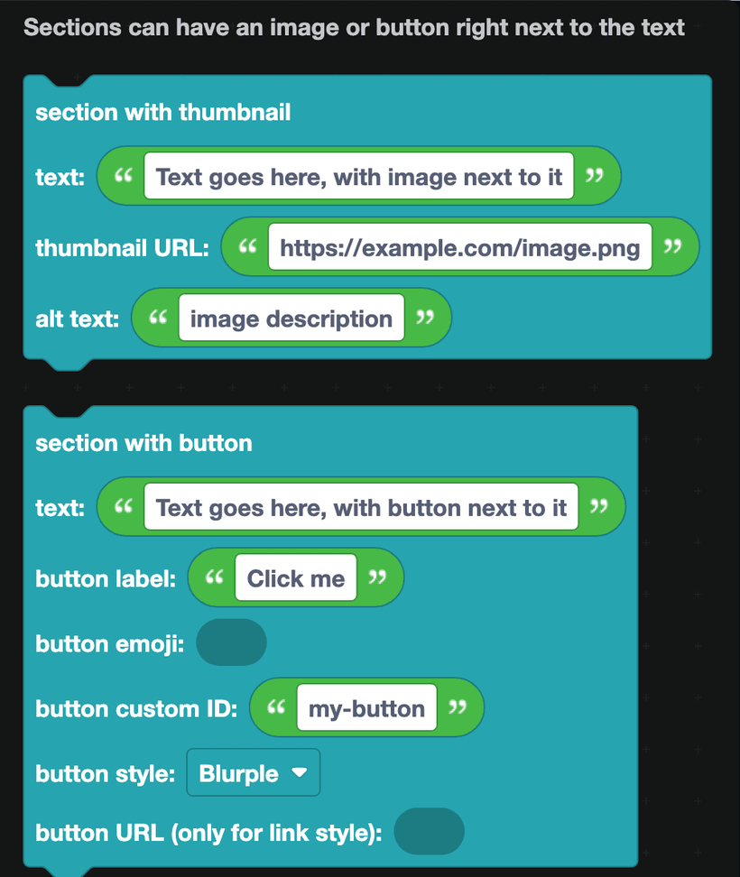
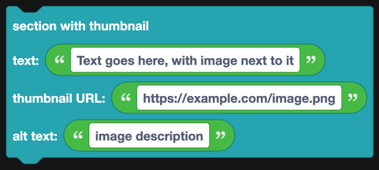
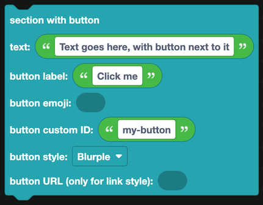

# Sections

A section is text with one thing beside it: either a small image or a button. It is the only way to put something to the *right* of text rather than below it.

## Section with thumbnail

Text on the left, a small square image on the right.

| Field | What it is |
| --- | --- |
| Text | The words. Markdown works here, same as a text display. |
| Thumbnail URL | A direct link to an image. It must be a public URL ending in an image extension. |
| Alt text | A description of the image for people using a screen reader. |

This is the shape most profile, rank and user info commands want: the details on the left, the avatar on the right.

## Section with button

Text on the left, a single button on the right.

| Field | What it is |
| --- | --- |
| Text | The words. |
| Button label | The text on the button. |
| Button emoji | An optional emoji on the button. |
| Button custom ID | The ID you check for in the `when a button is clicked` event. |
| Button style | Blurple, Gray, Green, Red, or Link. |
| Button URL | Only used when the style is Link. |

The button behaves exactly like one in an interactive row: give it a custom ID and answer it with the [Buttons](buttons.md) event blocks.

Sections are handy for lists of things that each need their own action, such as a settings page where each line has an "Edit" button next to it.

## Where sections can go

Anywhere in a component list, including inside a container.

## Notes

- A section holds one accessory. You cannot have both a thumbnail and a button on the same section.
- Image URLs have to be reachable by Discord. A file on your own computer will not work. Upload it somewhere public, or use the [File display](file-display.md) blocks to attach it to the message.
