# Select Menus

A select menu is a dropdown. It fits more choices into a message than buttons can, and Discord will fill some kinds of menu in for you.

  
Show the whole Select Menus flyout

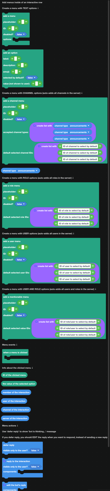

Every menu goes inside its own [interactive row](layout.md). A row that holds a menu cannot hold anything else.

## Text menus

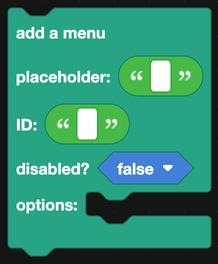

The menu you write the options for yourself.

| Field | What it is |
| --- | --- |
| Placeholder | The grayed-out text shown before anything is selected. |
| ID | The custom ID, used to recognize the menu in the event. |
| Disabled | When true, the menu cannot be opened. |
| Options | The `add an option` blocks. |

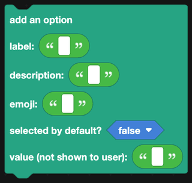

| Field | What it is |
| --- | --- |
| Label | What the user sees. |
| Description | A smaller second line under the label. |
| Emoji | An optional emoji beside the label. |
| Selected by default | Whether it starts selected. |
| Value | What your code receives. Not shown to the user. |

A menu holds up to 25 options.

## Menus Discord fills in

The other four menus populate themselves from the server, so you never have to build the list.

| Block | What it offers |
| --- | --- |
| 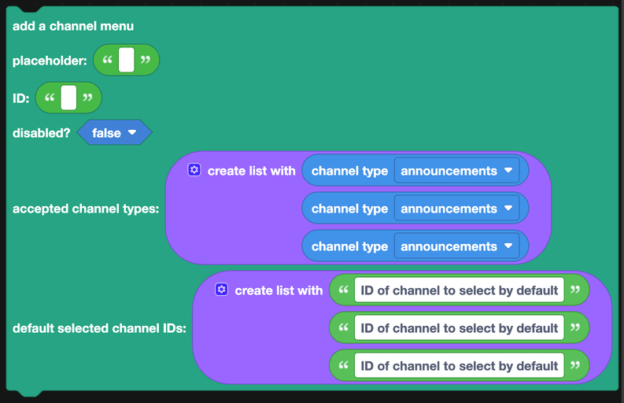 | Every channel. Restrict the kinds with `channel type` blocks. |
| 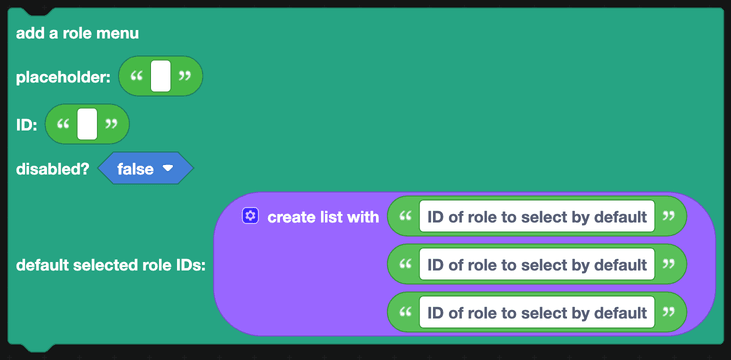 | Every role. |
|  | Every member. |
| 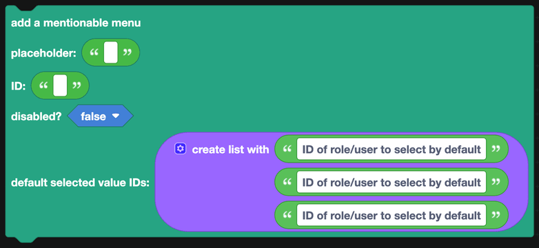 | Members and roles together. |

Each takes a list of IDs to pre-select, which is how you show a settings menu with the current choice already highlighted.

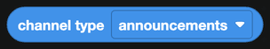

`channel type` restricts a channel menu. Put several in a list to allow several kinds.

## Responding to a selection

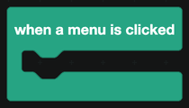

`when a menu is clicked` fires for every menu on your bot, so check which one first.

| Block | Returns |
| --- | --- |
| 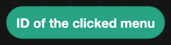 | The custom ID of the menu that was used. |
| 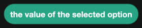 | What was selected. Text for a text menu, and the actual channel, role or user for the others. |
|  | The member who used the menu. |
|  | The user who used it. |
|  | The channel it happened in. |
|  | The server it happened in. |

:::tip
`the value of the selected option` returns a real Discord object for channel, role, user and mentionable menus. You can plug it straight into a block that expects a channel or a role, with no lookup needed.
:::

## Replying

The same three blocks as buttons: `reply to the interaction`, `defer reply` for slow work, and `edit the bot's reply` afterwards.

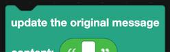

`update the original message` is different, and it is often what you want. Instead of sending a new reply, it rewrites the message the menu is on. Use it for a settings panel that should show the new state, or a paged list that should move to the next page in place.

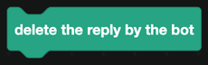

`delete the reply by the bot` removes the reply.

## A worked example: a role picker

1. Send a message with a role menu, ID `pick_role`, placeholder "Choose your roles".
2. In `when a menu is clicked`, check the ID.
3. `the value of the selected option` gives you the role directly.
4. Use `add role to member` from [Roles](../Servers/roles.md), with `member of the interaction`.
5. Reply, visible only to the user, confirming which role they got.
