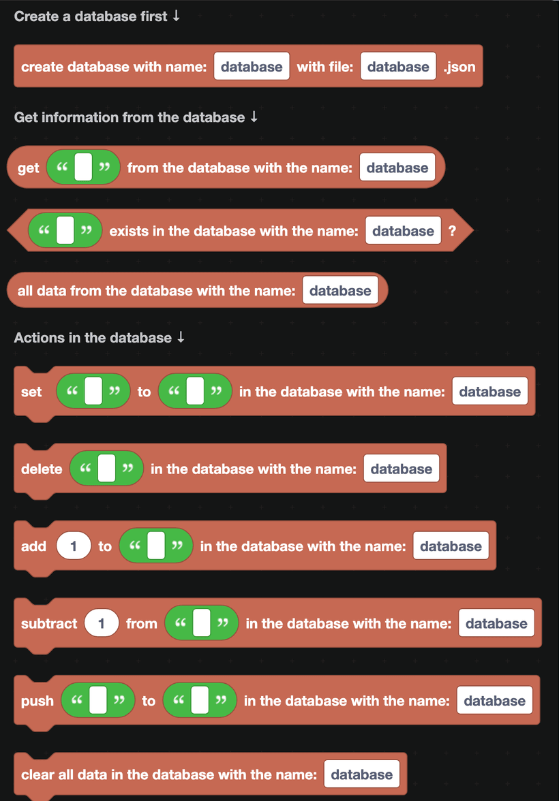
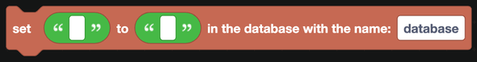
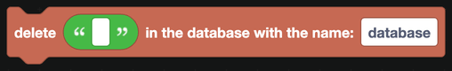
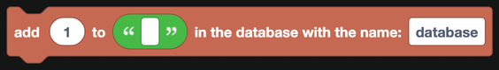
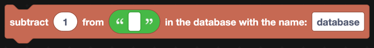
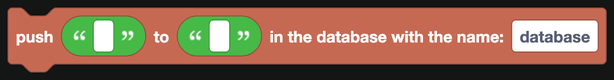

# Databases: Simple

A database is how your bot remembers things between restarts. Balances, levels, warnings, settings, ticket counts: all of it belongs in a database, not in a variable.

## How it works

DisFuse's simple database is a JSON file that sits next to your bot's code. It stores **keys** and **values**, like a very large dictionary: you give it a name, it gives you back what you stored under that name.

The file is created when the bot runs for the first time. If you are on a host that wipes files between restarts, your data will not survive, so check that your host has persistent storage.

## Creating a database

`create database with name ... with file ....json` sets one up. The **name** is what the other blocks refer to. The **file** is what it is called on disk.

Put this block inside `when the bot is logged in` from [Main](../main.md), before anything that reads or writes.

You can create several databases. Keeping economy data and server settings in separate files makes both easier to inspect by hand.

## Reading

| Block | Returns |
| --- | --- |
|  | The value stored under a key, or nothing if it is not there. |
|  | True when the key exists. |
|  | Everything in the database, as a list. |

`all data from the database` is how leaderboards are built: read everything, sort it with the [Lists](../lists.md) blocks, and show the top few.

## Writing

| Block | What it does |
| --- | --- |
|  | Stores a value under a key, replacing what was there. |
|  | Removes a key. |
|  | Adds a number to a numeric value. |
|  | Subtracts a number from it. |
|  | Adds an item onto a value that is a list. |
|  | Empties the whole database. |

`add` and `subtract` are safer than reading, calculating and setting, because they cannot lose an update that happened in between.

:::danger
`clear all data` cannot be undone. Do not put it behind a command anyone but you can run.
:::

## Choosing keys

A key is text, and it has to be unique. Build it out of the IDs involved:

| Key | Holds |
| --- | --- |
| `<user ID>` | Something about a user, everywhere. |
| `<server ID>-<user ID>` | Something about a user in one server. |
| `<server ID>-settings` | A server's configuration. |
| `warnings-<user ID>` | A list of warnings for one user. |

Use `create text with` from [Text](../text.md) to build these.

## Storing more than one value

A key holds one value. To store several things about a member, put them in an object:

1. Build an object with `create new object` from [Objects](../objects.md).
2. `convert object to JSON string`.
3. `set <key> to <that text>`.

To read it back, `get <key>`, run it through `convert JSON string to object`, then `get key` for the piece you want.

`push` works the same way for lists, and is the simplest way to keep a warning history.

:::warning
Values come out of the database as text. Before doing arithmetic on one, wrap it in `to number` from [Math](../math.md), or `5 + 5` will give you `55`.
:::

## When the simple database is not enough

It is a file, read and written by one bot process. That is fine for a bot in a few hundred servers. It is not fine when:

- Your bot runs on more than one machine at a time.
- You have hundreds of thousands of keys and the file becomes slow to load.
- You need to query by something other than the key.

At that point, use the [Fetch](../Apps/fetch.md) blocks to talk to a real database over an API, or write raw JavaScript with a database library from the [JavaScript](../javascript.md) category.

## A worked example: an economy balance

1. In `when the bot is logged in`, `create database with name economy with file economy.json`.
2. In your `/balance` command:
   - `if` `<user ID> exists in the database`, get it, otherwise use 0.
   - Reply with the number.
3. In your `/daily` command:
   - Check the cooldown, see [Cooldowns](../cooldowns.md).
   - `add 100 to <user ID> in the database`.
   - Reply with the new total.
