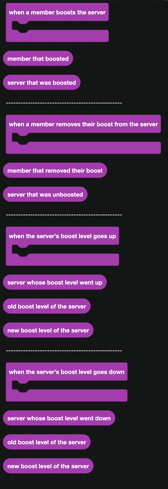
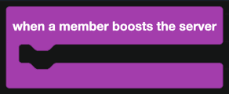
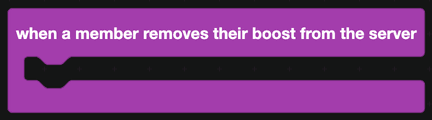
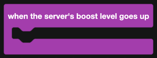
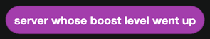
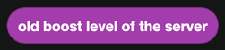
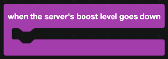
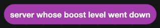
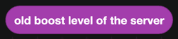

# Boosts

Events for server boosts: someone boosting, someone stopping, and the server's boost level moving up or down.

  
Show the whole Boosts flyout

## When a member boosts

| Companion block | Returns |
| --- | --- |
|  | The member who boosted. |
|  | The server they boosted. |

The obvious use is a thank-you message and a booster role, though Discord gives the booster role automatically.

## When a member removes their boost

| Companion block | Returns |
| --- | --- |
|  | The member who stopped boosting. |
|  | The server. |

Use it to remove any perks you granted, such as a custom role or a database flag.

## When the boost level goes up

| Companion block | Returns |
| --- | --- |
|  | The server. |
|  | The level before. |
|  | The level now. |

## When the boost level goes down

| Companion block | Returns |
| --- | --- |
|  | The server. |
|  | The level before. |
|  | The level now. |

Level changes matter because they change what the server can do: more emoji slots, larger uploads, better audio. Announcing them gives boosters something visible for their money.

## Related blocks

For reading the current boost count and level at any time, and for the boost progress bar, see [Server](../Servers/server.md).

## A worked example: a boost announcement

1. `when a member boosts the server`.
2. Send a message in your announcements channel with a container, a pink accent color, and a section using the booster's avatar as the thumbnail.
3. Include `number of boosts of server` and `boost level of server` from [Server](../Servers/server.md) so people can see how close the next level is.
4. Add 1 to the booster's total in a [database](../Databases/simple.md), so a `/boosts` leaderboard is possible later.
