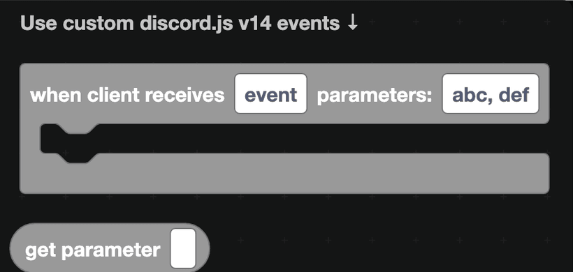
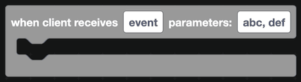
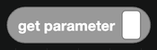

# Custom Events

DisFuse has a block for the events people use most. For anything else, the custom event block gives you every event discord.js supports.

## The blocks

`when client receives event ... parameters ...` listens for a raw discord.js event.

- **Event** is the discord.js event name, such as `voiceStateUpdate` or `guildBanAdd`.
- **Parameters** is a comma-separated list of names for the values that event hands over, in order.

`get parameter` reads one of the values you named.

## An example

Discord fires `voiceStateUpdate` with two values: the state before, and the state after. So:

1. Set the event to `voiceStateUpdate`.
2. Set the parameters to `oldState, newState`.
3. Inside, use `get parameter` and pick `newState`.

The value you get is a raw discord.js object, not a DisFuse type. To do anything with it you will usually need a [raw JavaScript](../javascript.md) block, for example `newState.channel?.name`.

## Events worth knowing about

| Event name | Fires when |
| --- | --- |
| `voiceStateUpdate` | Somebody joins, leaves or moves between voice channels |
| `guildBanAdd` | A member is banned |
| `guildBanRemove` | A ban is lifted |
| `channelUpdate` | A channel's settings change |
| `guildUpdate` | The server's settings change |
| `roleUpdate` | A role is edited |
| `threadUpdate` | A thread is archived, locked or renamed |
| `typingStart` | Somebody starts typing |
| `guildScheduledEventCreate` | A scheduled event is made |
| `guildAuditLogEntryCreate` | An audit log entry appears |

The full list is in the [discord.js documentation](https://discord.js.org/docs/packages/discord.js/main/Client:Class), under the Client class.

:::warning
The custom event block does no checking. A misspelled event name simply never fires, and a wrong parameter name gives you nothing. If a custom event seems dead, add a `console log` from [JavaScript](../javascript.md) as the very first block inside it to confirm whether it is running at all.
:::

## Intents apply here too

Custom events obey the same intent rules as everything else. `voiceStateUpdate` needs the Guild Voice States intent, and member events need the Server Members intent. DisFuse requests all available intents when your bot starts, so switching them on in the Discord Developer Portal is all you need to do.

## A worked example: a voice log

1. Event `voiceStateUpdate`, parameters `oldState, newState`.
2. A raw JavaScript value block with `newState.channel?.name ?? null` to get the channel joined.
3. If it is not null, send a line to your log channel saying who joined which channel.
