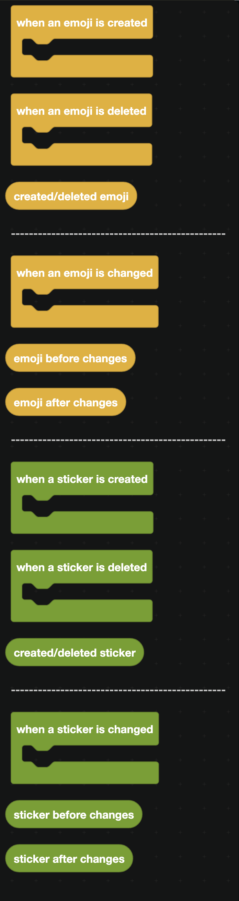
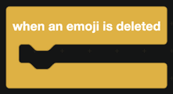
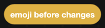
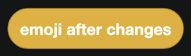
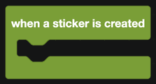
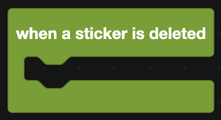
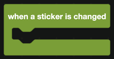

# Emojis and Stickers

Events for a server's custom expressions being added, removed or changed.

  
Show the whole Emojis and Stickers flyout

## Emoji events

| Block | Fires when |
| --- | --- |
|  | An emoji is uploaded. |
|  | An emoji is removed. |

`created/deleted emoji` works inside both of those events.

`when an emoji is changed` fires on a rename or a change to which roles can use it.

| Companion block | Returns |
| --- | --- |
|  | The emoji before the change. |
|  | The emoji after. |

## Sticker events

The same four blocks exist for stickers.

| Block | Fires when |
| --- | --- |
|  | A sticker is uploaded. |
|  | A sticker is removed. |
|  | The sticker involved, inside either event. |
|  | A sticker is renamed or edited. |
|  | The sticker before the change. |
|  | The sticker after. |

## Reading the emoji or sticker

The blocks for getting a name, ID, image URL or author are in [Emojis](../Servers/emojis.md) and [Stickers](../Servers/stickers.md).

## A worked example: an expression log

1. `when an emoji is created`.
2. Send a message in your log channel with a media gallery containing `get image/gif URL of the emoji <created/deleted emoji>`.
3. Add a text display with the name and who uploaded it, using `get author of the emoji`.
4. Repeat with `when an emoji is deleted` so removals are logged too.

A log like this is useful in large servers where several people have permission to manage expressions and emoji slots run out.
