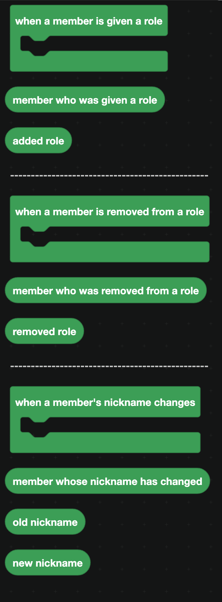
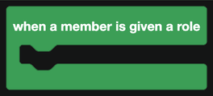
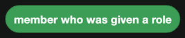
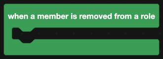
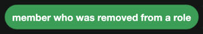
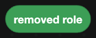
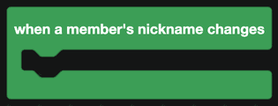
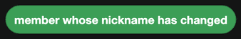
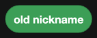

# Member Actions

Events for changes to a member inside a server: roles being given or taken, and nicknames changing.

  
Show the whole Member Actions flyout

## When a member is given a role

| Companion block | Returns |
| --- | --- |
|  | The member who was given a role. |
|  | The role they were given. |

Use it to announce a promotion, to grant a linked perk, or to log staff changes.

## When a member is removed from a role

| Companion block | Returns |
| --- | --- |
|  | The member the role was taken from. |
|  | The role that was removed. |

## When a nickname changes

| Companion block | Returns |
| --- | --- |
|  | The member. |
|  | The nickname before. |
|  | The nickname now. |

Both nickname blocks come back empty when the nickname was cleared, so a change from a nickname to none gives you an old value and an empty new one.

:::warning
These events need the **Server Members Intent**, switched on in the Discord Developer Portal.
:::

## A loop worth avoiding

If a role event adds another role, and that role's event adds the first one back, your bot will loop forever. Always check which role changed before acting.

## A worked example: a staff log

1. `when a member is given a role`.
2. Check whether `name of role <added role>` is one you care about, such as Moderator.
3. Send a line to your staff channel: who got it, which role, and a Discord timestamp.
4. Add a second event block for `when a member is removed from a role`, doing the same in reverse.
