# Message Actions

Events for things that happen to messages after they are sent: deletions, edits, pins, replies and reactions.

  
Show the whole Message Actions flyout

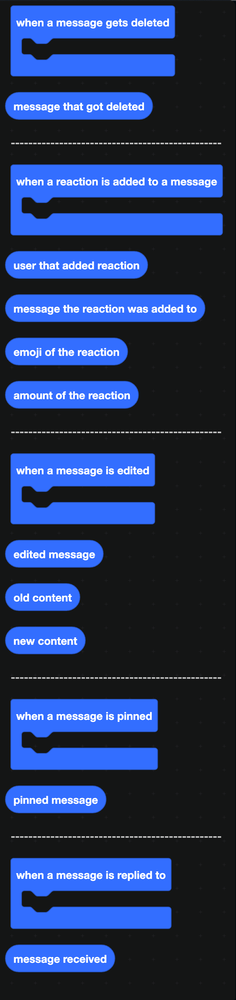

For the event that fires when a message is first sent, see [Message](../Messages/message.md).

## When a message gets deleted

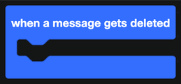

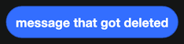

`message that got deleted` is the message. This is the basis of a message logging channel.

:::info
Discord only reports deletions for messages your bot has seen since it started. A message posted before the last restart is not in the cache, so the deletion may come through with almost nothing in it.
:::

## When a reaction is added

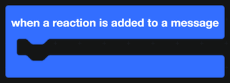

| Companion block | Returns |
| --- | --- |
|  | Who reacted. |
| 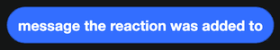 | The message they reacted to. |
| 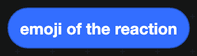 | The emoji they used. |
| 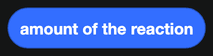 | How many people have used that emoji now. |

Reaction roles, starboards and reaction-based confirmations all start here.

:::tip
Buttons are usually a better choice than reaction roles now. They are faster, they cannot be added by anyone but your bot, and the click tells you exactly who pressed what. See [Buttons](../Components/buttons.md).
:::

## When a message is edited

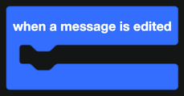

| Companion block | Returns |
| --- | --- |
| 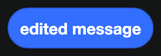 | The message, after the edit. |
|  | What it said before. |
|  | What it says now. |

Having both versions is what makes an edit log worth reading.

## When a message is pinned

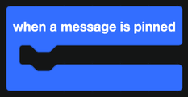

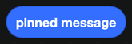

`pinned message` is the message that was pinned.

## When a message is replied to

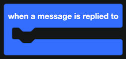

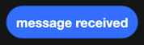

Inside this event, `message received` is the reply itself. Use `message that ... replied to` from [Message](../Messages/message.md) to get the original.

## Message content

Reading `get content of message received` for messages your bot was not mentioned in requires the **Message Content Intent**. Without it, the old and new content blocks come back empty. See [Creating a Discord bot](../../Guide/creating-a-bot.md).

## A worked example: a delete log

1. `when a message gets deleted`.
2. Skip it if `is user <author> a bot?` is true, so your own messages do not fill the log.
3. Send a message to your log channel with a container holding:
   - a text display naming the author and the channel
   - a separator
   - a text display with the deleted content
4. Add a Discord timestamp with `create timestamp from date` from [Time](../time.md).
