# Server Actions

Members joining and leaving, and the bot being added to or removed from a server.

  
Show the whole Server Actions flyout

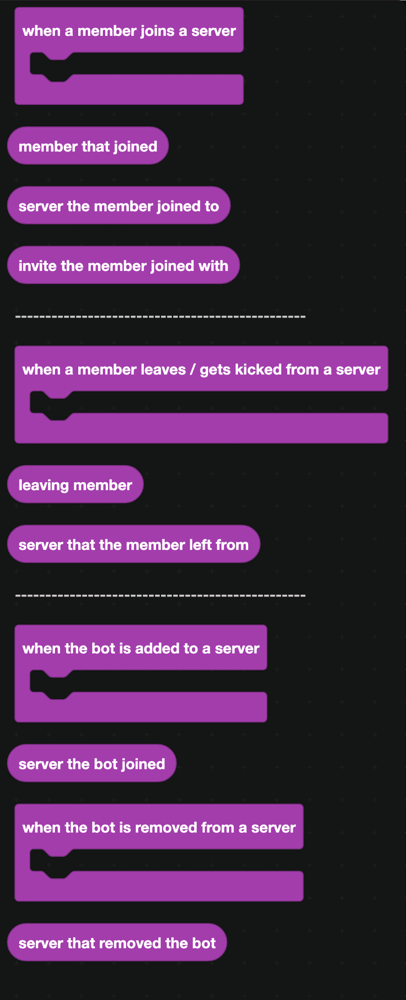

## When a member joins

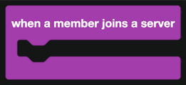

Fires whenever somebody joins a server your bot is in.

| Companion block | Returns |
| --- | --- |
| 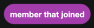 | The member who joined. |
| 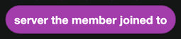 | The server they joined. |
| 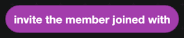 | The invite they used. |

This is where welcome messages, autoroles, invite tracking and join gates all start.

:::warning
This event needs the **Server Members Intent**, which you switch on in the Discord Developer Portal. Without it your bot never hears about joins.
:::

`invite the member joined with` needs the bot to have the **Manage Server** permission, because that is what lets it read the invite list.

## When a member leaves

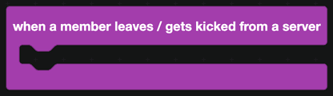

Fires when somebody leaves, is kicked, or is banned. Discord does not tell you which, so if you need to tell a leave from a kick, check the audit log.

| Companion block | Returns |
| --- | --- |
| 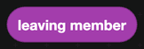 | The member who left. |
| 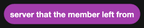 | The server they left. |

## When the bot is added to a server

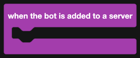

Fires when somebody invites your bot somewhere new.

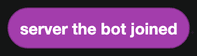

`server the bot joined` is the new server.

Use it to send a setup message to the server owner, to create default settings in your database, or to log growth.

## When the bot is removed from a server

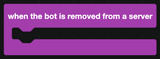

Fires when your bot is kicked or banned from a server, or the server is deleted.

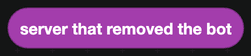

`server that removed the bot` is the server it left.

Use it to clean that server's data out of your database.

## A worked example: a welcome message

1. `when a member joins a server`.
2. `get the channel with the name equal to welcome on the server <server the member joined to>`.
3. `send message in channel` with a container holding:
   - a section with thumbnail, using `avatar URL of <member that joined>`
   - a text display with "Welcome, " and a mention of the member
4. Add `add role to member` to give them a starting role.

To make it work in every server rather than only yours, store the welcome channel ID per server in a [database](../Databases/simple.md) or a [website dashboard setting](../dashboard.md).
