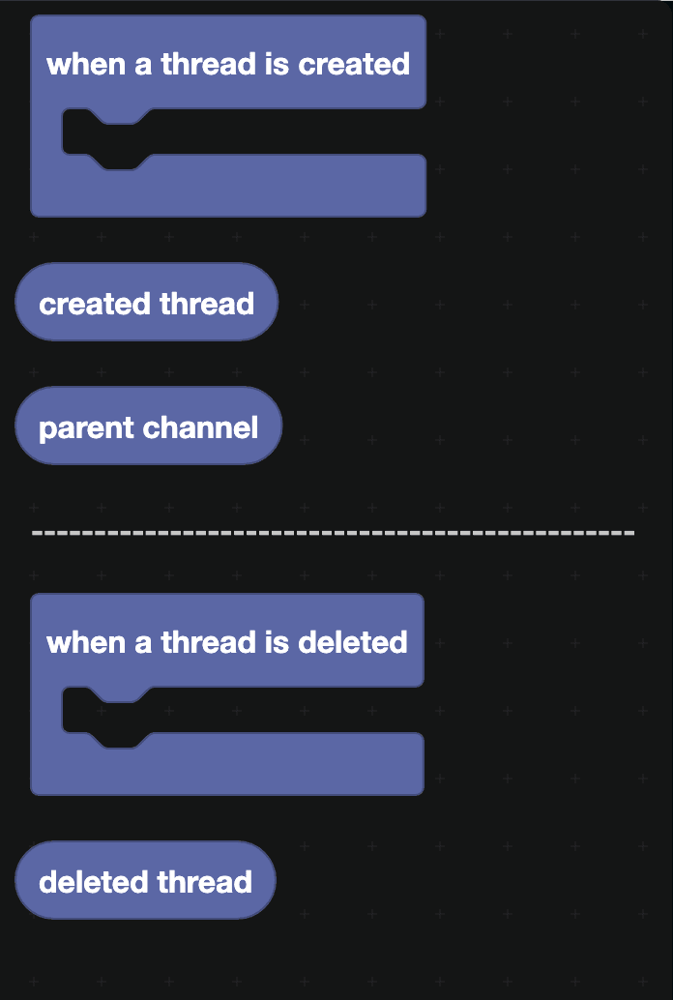
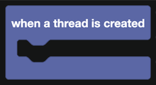
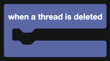

# Thread Actions

Two events, for threads appearing and disappearing.

## When a thread is created

| Companion block | Returns |
| --- | --- |
|  | The new thread. |
|  | The channel it was created in. |

Fires for threads anyone creates, including forum posts, which are threads in a forum channel.

Common uses:

- **Auto-join.** Have the bot `join thread` so it receives messages in it.
- **Forum posts.** Send a first reply with the rules of the forum, or apply a tag.
- **Support threads.** Ping the support role when a thread appears in a specific channel.

## When a thread is deleted

`deleted thread` is the thread that was removed. Use it to clean up anything you stored against its ID.

Note that archiving is not deleting. An archived thread still exists and does not fire this event. To notice archiving, poll `is thread ... archived?` from [Threads](../Messages/threads.md), or use the [Custom](custom.md) event block with `threadUpdate`.

## A worked example: forum welcome posts

1. `when a thread is created`.
2. Check that `name of channel <parent channel>` is your support forum.
3. `join thread` so the bot can see replies.
4. `send message in channel <created thread>` with a container explaining what information to include and a button that closes the post.
