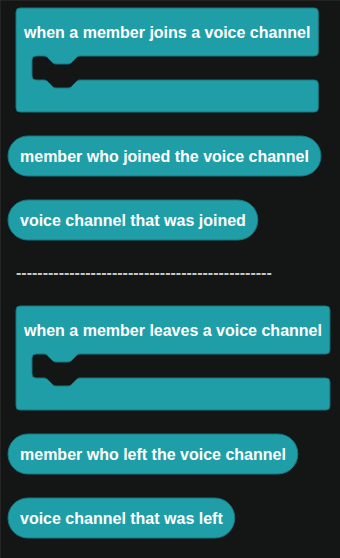

# Voice Actions

Events for members moving in and out of voice channels.

  
Show the whole Voice Actions flyout

## When a member joins a voice channel

| Companion block | Returns |
| --- | --- |
|  | The member who joined. |
|  | The voice channel they joined. |

## When a member leaves a voice channel

| Companion block | Returns |
| --- | --- |
|  | The member who left. |
|  | The voice channel they left. |

## A worked example: temporary voice channels

1. In `when a member joins a voice channel`, check whether `voice channel that was joined` is your "Join to create" channel.
2. If it is, create a new voice channel named after the member and move them into it.
3. In `when a member leaves a voice channel`, delete `voice channel that was left` if it is one you created and nobody is left in it.
