# Message

Everything you do with a single message: catch it when it arrives, read it, reply, edit, delete, pin and react.

  
Show the whole Message flyout

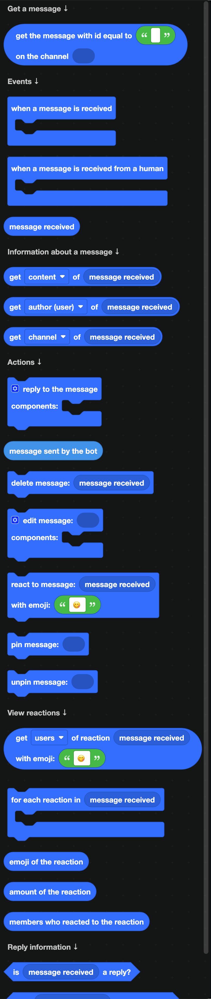

## Catching a message

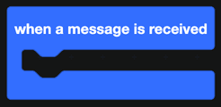

`when a message is received` fires for every message in every channel your bot can see, including messages from other bots and from your own bot.

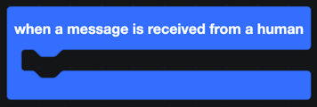

`when a message is received from a human` is the same event with bot messages filtered out. Use this one unless you specifically want to react to bots. It saves you an `if` and prevents the classic loop where your bot replies to itself forever.

Inside either event, `message received` is the message itself.

## Reading a message

One block with a dropdown covers the common properties: **content**, **author (user)** and **channel**.

| Block | Returns |
| --- | --- |
|  | True when the message is a reply to another. |
| 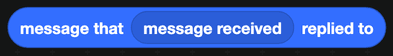 | The message it replied to. |
|  | Whether the reply pinged the person being replied to. |

## Getting a specific message

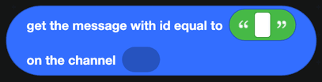

`get the message with id equal to ... on the channel ...` fetches a message you know the ID of. Enable Developer Mode in Discord to copy a message ID from the right-click menu.

To fetch several at once, use `get last ... messages of channel` from [Channels](../Servers/channels.md).

## Sending and editing

| Block | What it does |
| --- | --- |
| 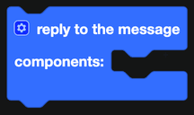 | Replies to the message, in the same channel. |
| 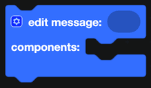 | Replaces the components of a message the bot sent. |
| 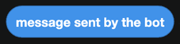 | The message that was just sent. Use it right after a send or reply block. |

Both take a **components** input. See [Components](../Components/components.md) for what goes in it.

:::info
A bot can only edit its own messages. Discord does not allow anything else.
:::

## Deleting

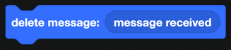

`delete message` removes it. The bot needs the Manage Messages permission unless the message is its own.

To clear a lot at once, use `delete the last ... messages on channel` from [Channels](../Servers/channels.md).

## Pinning

| Block | What it does |
| --- | --- |
|  | Pins the message. |
|  | Unpins it. |

A channel can hold 50 pinned messages.

## Reactions

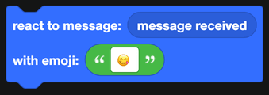

`react to message ... with emoji` adds a reaction. Use a standard emoji directly, or the name of a custom emoji from the server.

### Reading reactions

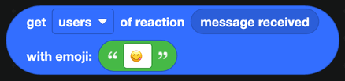

`get users of reaction ... with emoji` gives you a list of everyone who reacted with a specific emoji. The dropdown also offers the count.

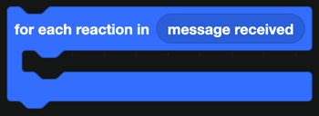

`for each reaction in ...` loops over every reaction on the message. Inside the loop:

| Block | Returns |
| --- | --- |
| 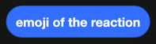 | The emoji of the current reaction. |
| 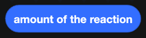 | How many people used it. |
|  | The members who used it. |

For the event that fires the moment somebody reacts, see [Message Actions](../Events/message-actions.md).

## A worked example: a starboard

1. `when a reaction is added to a message` from [Message Actions](../Events/message-actions.md).
2. Check the emoji is ⭐ and the count is at least 3.
3. Build a message with a container, the original text, and a link back.
4. `send message in channel` into your starboard channel.
5. Store the original message ID in a [database](../Databases/simple.md) so you never post the same message twice.
