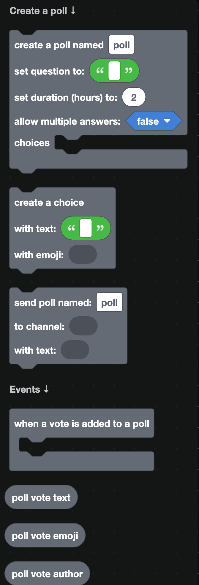
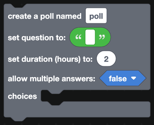
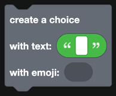
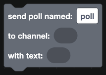
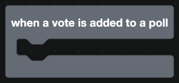
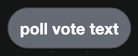
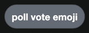
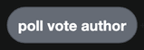

# Polls

Discord has polls built in. Your bot can create one, send it, and react when someone votes.

  
Show the whole Polls flyout

## Creating a poll

`create a poll named ...` builds the poll. The name is a label you choose, used by the send block later, so you can build more than one poll at a time.

| Field | What it is |
| --- | --- |
| Question | The text at the top of the poll. |
| Duration | How many hours the poll runs for. |
| Allow multiple answers | Whether people can pick more than one option. |
| Choices | The `create a choice` blocks. |

Each choice has text and an optional emoji. A poll can have up to 10 choices.

## Sending a poll

`send poll named ... to channel ... with text ...` posts it. The text is a normal component list, so you can put a text display above the poll.

## Reacting to votes

`when a vote is added to a poll` fires each time somebody votes.

| Block | Returns |
| --- | --- |
|  | The text of the choice that was picked. |
|  | The emoji of that choice. |
|  | Who voted. |

## Notes

- Discord shows the results itself. You do not need to count anything to display a tally.
- A poll cannot be edited after it is sent. To change it, delete the message and send a new poll.
- Polls run for at most 32 days.
- If you need something a poll cannot do, such as ranked choices or a hidden vote count, build it with [buttons](../Components/buttons.md) and a [database](../Databases/simple.md) instead.

## A worked example

A weekly poll that announces the winner:

1. A slash command that builds a poll with `create a poll` and sends it.
2. `when a vote is added to a poll`, write the vote into a database keyed by the voter's ID, so nobody is counted twice.
3. Separately, read the database when the poll closes and post the totals.
