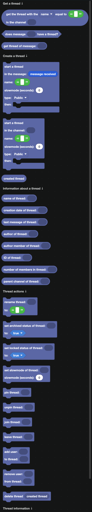
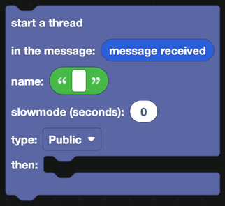
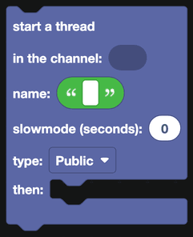
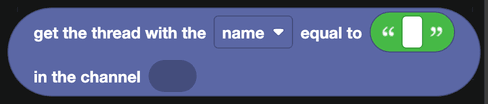
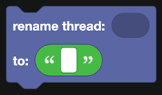
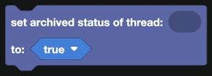
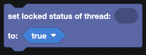
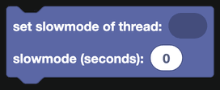
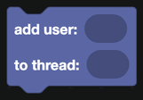
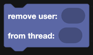

# Threads

A thread is a temporary side conversation inside a channel. Ticket systems, support posts and forum channels are all built out of them.

  
Show the whole Threads flyout

## Creating a thread

`start a thread in the message` attaches a thread to an existing message. Everyone who can see the message can see the thread.

`start a thread in the channel` creates a standalone thread with no starter message.

Both blocks take:

| Field | What it is |
| --- | --- |
| Name | The thread title. |
| Slowmode | Seconds between messages, 0 for none. |
| Type | Public, Private, or Announcement. |
| then | Blocks that run once the thread exists. |

Inside the `then` part, `created thread` is the new thread. Use it to send the first message, add people, or store its ID.

:::info
Private threads need a boosted server on some Discord plans. If creation fails, try a public thread first to rule this out.
:::

## Finding a thread

| Block | Returns |
| --- | --- |
|  | A thread in a channel, by name. |
|  | True when a message has a thread on it. |
|  | The thread attached to a message. |
|  | True when a message was sent inside a thread. |
|  | The thread a message is in. |

## Reading a thread

| Block | Returns |
| --- | --- |
|  | The thread's name. |
|  | Its ID. |
|  | When it was created. |
|  | The user who started it. |
|  | The same person, as a member of the server. |
|  | The most recent message in it. |
|  | How many people have joined it. |
|  | The channel the thread lives in. |
|  | Whether the thread is locked, archived or invitable. |

## Managing a thread

| Block | What it does |
| --- | --- |
|  | Renames the thread. |
|  | Archives or unarchives it. Archived threads drop out of the channel list. |
|  | Locks it, so only moderators can send messages. |
|  | Sets the seconds between messages. |
|  | Pins the thread in a forum channel. |
|  | Unpins it. |
|  | Adds the bot to the thread. |
|  | Removes the bot from it. |
|  | Adds someone to the thread. |
|  | Removes someone. |
|  | Deletes the thread and everything in it. |

## Events

For the moment a thread is created or deleted, see [Thread Actions](../Events/thread-actions.md).

## A worked example: a ticket system

1. A button with the ID `ticket_open`, in a message pinned in your support channel.
2. In `when a button is clicked`, check the ID.
3. `start a thread in the channel`, private, named after the person who clicked.
4. In the `then` part, `add user to thread` with `user of the interaction`, and send a first message explaining what to do.
5. A second button, `ticket_close`, which sets the thread to locked and then archived.
6. Reply to the original click, visible only to the user, with a link to their thread.
