# Channels

Channels are where everything happens. This subcategory creates them, reads them, changes them, and sends messages into them.

  
Show the whole Channels flyout

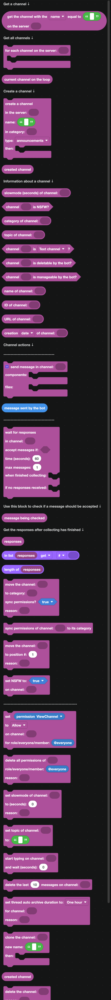

## Sending a message

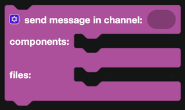

`send message in channel` is the block you will use more than any other in DisFuse. Give it a channel, then build the message in the **components** input using the [Components](../Components/components.md) blocks. The **files** input takes [file](../Components/file-display.md) blocks.

Right after sending, `message sent by the bot` is the message that just went out. Use it to react to it, pin it, or store its ID.

## Getting a channel

| Block | Returns |
| --- | --- |
| 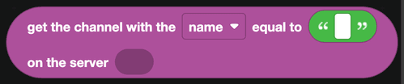 | A channel by name, or by ID. |
| 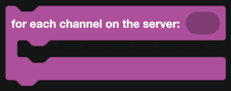 | Loops over every channel in a server. |
|  | The channel being handled inside that loop. |

## Creating a channel

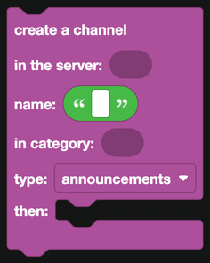

`create a channel in the server` takes a name, an optional category, and a type: text, announcements, voice, stage or forum. Blocks in the `then` part run once it exists.

`created channel` is the new channel. Send a welcome message into it, set permissions on it, or store its ID.

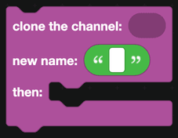

`clone the channel` copies an existing channel, permissions included, under a new name. This is how "nuke and recreate" moderation commands work.

## Reading a channel

| Block | Returns |
| --- | --- |
| 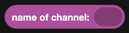 | The channel name. |
|  | Its ID. |
|  | A link that jumps to it. |
|  | The channel topic. |
|  | The category it sits in. |
|  | Its slowmode, in seconds. |
|  | Whether it is marked age restricted. |
|  | Whether it is a given kind of channel. |
| 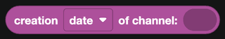 | When it was created. |
|  | Whether the bot is allowed to delete it. |
|  | Whether the bot is allowed to change it. |

## Changing a channel

| Block | What it does |
| --- | --- |
| 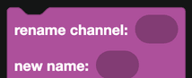 | Renames the channel. |
| 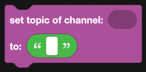 | Sets the topic. |
| 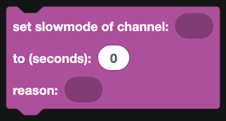 | Sets seconds between messages. |
| 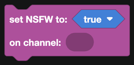 | Marks it age restricted. |
| 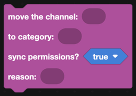 | Moves it into a category, optionally syncing permissions. |
| 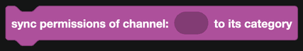 | Resets its permissions to match its category. |
| 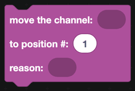 | Moves it up or down the channel list. |
| 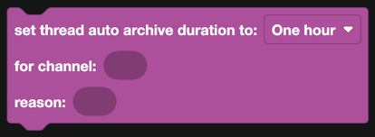 | Sets how long threads stay active before archiving. |
| 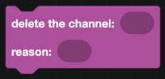 | Deletes the channel. |

Most of these accept a **reason**, which is written into the server's audit log.

## Permissions

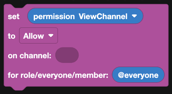

`set permission ... to Allow/Deny/Default on channel ... for role/everyone/member` is how you lock a channel down or open it up. Pick the permission from the dropdown, and the target can be a role, a member, or everyone.

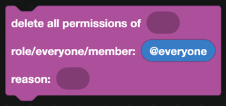

`delete all permissions of ...` removes a role or member's override entirely, so they fall back to the server defaults.

This pair is what ticket bots use: create a channel, deny View Channel for everyone, allow it for the person who opened the ticket.

## Bulk actions

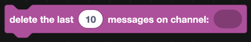

`delete the last ... messages on channel` clears a number of recent messages at once.

:::warning
Discord does not allow bulk deleting messages older than 14 days. Anything older has to be deleted one at a time.
:::

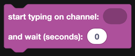

`start typing on channel` shows the "bot is typing" indicator. Use it before something slow so the channel does not look dead.

## Reading recent messages

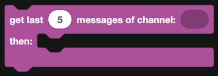

`get last ... messages of channel` fetches a batch. Inside the `then` part:

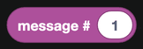

`message # 1` picks one out of the batch by position.

## Waiting for a reply

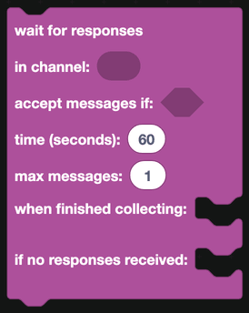

`wait for responses in channel` collects messages for a while, then runs one of two stacks: one when messages arrived, one when the time ran out.

| Field | What it is |
| --- | --- |
| Accept messages if | A test that decides whether a message counts. |
| Time (seconds) | How long to wait. |
| Max messages | How many to collect before stopping early. |
| When finished collecting | Runs with the collected messages. |
| If no responses received | Runs when nothing matched in time. |

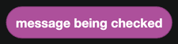

Inside the filter, `message being checked` is the candidate. A common filter is "the author is the person who ran the command".

In the finished part, `responses` is a list. Use the [Lists](../lists.md) blocks to read it.

This is how you build a setup wizard that asks questions in a channel one at a time.

## A worked example: a lockdown command

1. A slash command called `lockdown`.
2. `for each channel on the server`.
3. Skip anything that is not a text channel, using `channel is Text channel?`.
4. `set permission Send Messages to Deny on channel <current channel> for @everyone`, with the reason "Lockdown by " and the moderator's name.
5. Reply with how many channels were locked.
