# Emojis

Blocks for a server's custom emojis: reading them, creating them, renaming them and deleting them.

  
Show the whole Emojis flyout

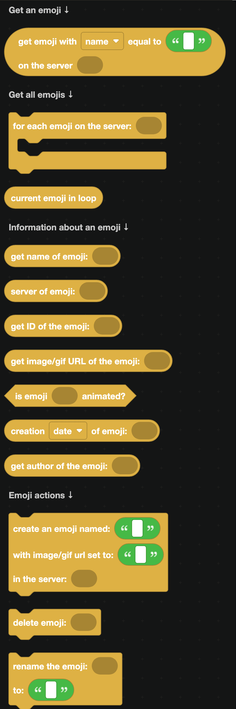

## Getting an emoji

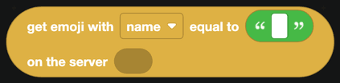

`get emoji with name equal to ... on the server ...` finds a custom emoji by name or ID.

| Block | What it does |
| --- | --- |
| 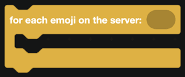 | Loops over every emoji in a server. |
| 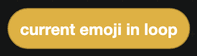 | The emoji being handled. |

## Reading an emoji

| Block | Returns |
| --- | --- |
| 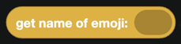 | The emoji name, without colons. |
|  | Its ID. |
| 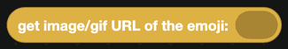 | A URL to the image or GIF. |
| 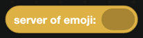 | The server it belongs to. |
| 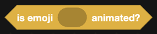 | True when it is animated. |
| 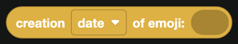 | When it was uploaded. |
| 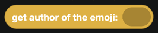 | Who uploaded it. |

## Managing emojis

| Block | What it does |
| --- | --- |
| 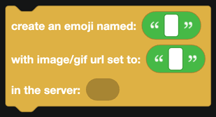 | Uploads a new emoji from an image or GIF URL. |
| 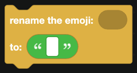 | Renames an emoji. |
| 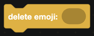 | Deletes it. |

Creating and deleting emojis needs the **Manage Expressions** permission.

## Using an emoji in a message

Custom emojis are written in a special form in message text:

- Static: `<:name:id>`
- Animated: `<a:name:id>`

Build that with `create text with` from [Text](../text.md), using the emoji's name and ID blocks. Blocks that take an emoji directly, such as `react to message`, accept the emoji name on its own.

## Emoji limits

| Boost level | Static | Animated |
| --- | --- | --- |
| None | 50 | 50 |
| Level 1 | 100 | 100 |
| Level 2 | 150 | 150 |
| Level 3 | 250 | 250 |

Images must be under 256 KB. Discord rejects anything larger.

## Events

For when an emoji is created, deleted or renamed, see [Emojis and Stickers](../Events/emojis-stickers.md).

## A worked example: an emoji list command

1. A slash command called `emojis`.
2. `for each emoji on the server`.
3. Build a piece of text using `create text with`, appending `<:name:id>` for each one.
4. Send the result as a text display, in a container.
