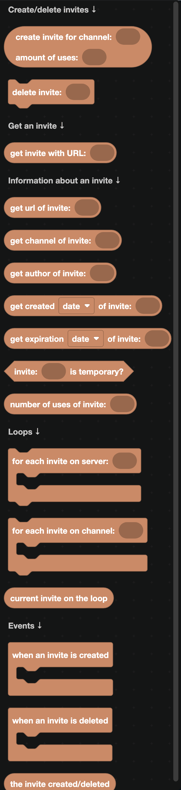
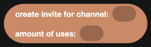
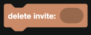
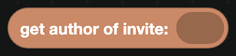
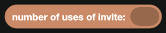
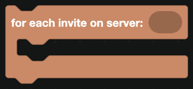
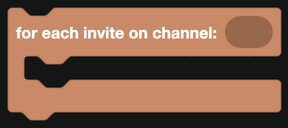
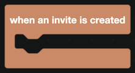

# Invites

Invite blocks create, read and delete invite links, and they let you tell which invite somebody joined with.

  
Show the whole Invites flyout

## Creating and deleting

`create invite for channel ... amount of uses ...` makes a new invite and returns it. Set uses to 0 for an unlimited invite.

`delete invite` revokes it. Anyone holding the link can no longer use it.

## Getting an invite

`get invite with URL` looks one up from its link or code. It works for invites to other servers too, which is how invite filters check what a posted link points at.

## Reading an invite

| Block | Returns |
| --- | --- |
|  | The full invite link. |
|  | The channel it leads to. |
|  | Who created it. |
|  | When it was created. |
|  | When it expires. |
|  | Whether it grants temporary membership. |
|  | How many times it has been used. |

## Loops

| Block | What it does |
| --- | --- |
|  | Loops over every invite in a server. |
|  | Loops over the invites for one channel. |
|  | The invite being handled. |

## Events

| Block | Fires when |
| --- | --- |
|  | Somebody creates an invite. |
|  | An invite is revoked or runs out. |
|  | The invite involved, inside either event. |

## Invite tracking

The `when a member joins a server` event in [Server Actions](../Events/server-actions.md) has an `invite the member joined with` block, so you do not need to compare use counts yourself.

An invite leaderboard is then:

1. `when a member joins a server`.
2. `get author of invite <invite the member joined with>`.
3. `add 1 to <that user's ID>` in a [database](../Databases/simple.md).

:::info
Invite tracking needs the **Manage Server** permission. Without it the bot cannot see the invite list, and the invite block comes back empty.
:::

## A worked example: blocking other servers' invites

1. `when a message is received from a human`.
2. Use a `test regexp` block from [Text](../text.md) with a pattern matching `discord.gg/`.
3. If it matches, `delete message` and reply with a warning.
4. To allow your own invites through, use `get invite with URL` and compare its server ID with the current one before deleting.
