# Members

Everything about the people in a server: reading who they are, and the moderation actions you can take on them.

  
Show the whole Members flyout

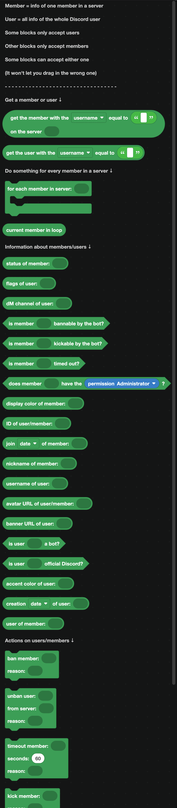

## Members and users

This is the distinction to get straight first.

- A **user** is a Discord account. Username, avatar, banner, creation date. The same everywhere.
- A **member** is that user inside one server. Nickname, roles, join date, server color.

Some blocks accept either. Anything that bans, kicks, times out or changes roles needs a **member**, because those things only exist inside a server. The editor will not let you plug the wrong one in.

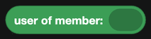

`user of member` converts a member into the user behind it.

## Getting a member or user

| Block | Returns |
| --- | --- |
| 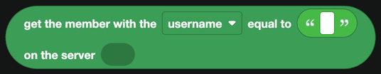 | A member of a server, by username or ID. |
| 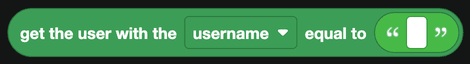 | A Discord user, by username or ID. |

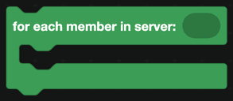

`for each member in server` loops over everyone.

`current member in loop` is the one being handled.

:::warning
Looping over every member in a large server is slow, and it needs the **Server Members Intent** switched on in the Discord Developer Portal. If the loop runs zero times, that intent is usually why.
:::

## Reading a member or user

| Block | Returns |
| --- | --- |
| 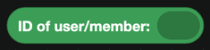 | The Discord ID. |
| 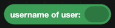 | The account username. |
| 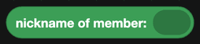 | The server nickname, if set. |
| 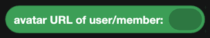 | A URL to the avatar. |
| 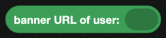 | A URL to the profile banner. |
| 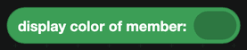 | The color their name shows in, from their highest colored role. |
| 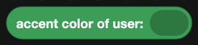 | Their profile accent color. |
| 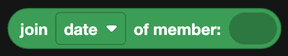 | When they joined the server. |
| 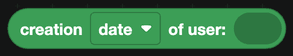 | When the account was made. |
| 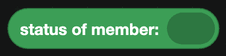 | Online, idle, do not disturb or offline. |
| 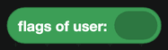 | Discord account badges, as a list. |
|  | True when the account is a bot. |
| 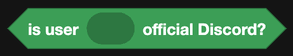 | True when it is an official Discord account. |
| 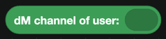 | The DM channel with that user. |

`creation date of user` is the block behind account-age checks. Comparing it against the current date catches brand new accounts joining during a raid.

## Permission and safety checks

| Block | Returns |
| --- | --- |
| 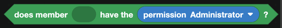 | Whether the member has a permission. |
|  | Whether the bot is allowed to ban them. |
|  | Whether the bot is allowed to kick them. |
|  | Whether they are currently timed out. |

Check `is member bannable by the bot?` before banning. It is false when the target's highest role is above the bot's, or when they own the server, and it saves you an error your user never sees.

## Moderation actions

| Block | What it does |
| --- | --- |
| 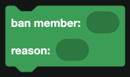 | Bans a member, with a reason for the audit log. |
| 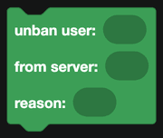 | Removes a ban from a server. Takes a user, since they are no longer a member. |
|  | Removes a member from the server. They can rejoin. |
| 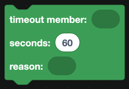 | Silences a member for a number of seconds. |
| 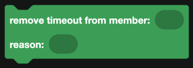 | Ends a timeout early. |
| 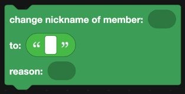 | Changes their server nickname. |

Timeouts are capped by Discord at 28 days.

## Direct messages

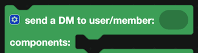

`send a DM to user/member` opens a direct message and sends it. It takes the same **components** input as any other send block.

:::warning
Sending a DM fails when the person has DMs from server members turned off, and there is nothing your bot can do about that. Wrap it in a `try` block from [JavaScript](../javascript.md) so one closed inbox does not stop the rest of your command.
:::

## Events

For joins, leaves, role changes and nickname changes, see [Server Actions](../Events/server-actions.md) and [Member Actions](../Events/member-actions.md).

## A worked example: a ban command

1. A slash command `ban` with a user option and a text option for the reason.
2. Check that `member of the interaction` has the Ban Members permission, and reply with an error if not.
3. Check `is member bannable by the bot?` on the target, and reply with an error if not.
4. Try to `send a DM` telling them they were banned, wrapped in a try block.
5. `ban member` with the reason.
6. Reply confirming it, and post a line in your mod log channel.
