# Roles

Roles carry permissions and color, and they are how almost every bot decides who is allowed to do what.

  
Show the whole Roles flyout

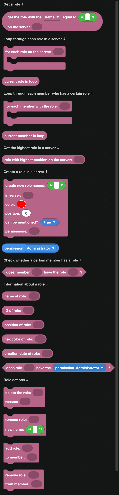

## Getting a role

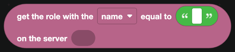

`get the role with the name equal to ... on the server ...` finds a role by name or ID. IDs are safer, since role names change.

`role with highest position on the server` gives you the top role, which is useful when checking whether the bot can act on someone.

## Loops

| Block | What it does |
| --- | --- |
| 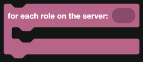 | Loops over every role in a server. |
|  | The role being handled. |
| 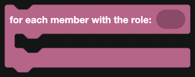 | Loops over everyone who has a specific role. |
|  | The member being handled. |

`for each member with the role` is the block behind "announce to everyone with the Subscriber role" and similar features.

## Creating a role

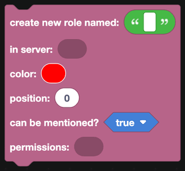

`create new role named ...` takes a name, server, color, position, whether it can be mentioned, and a list of permissions.

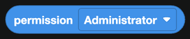

`permission ...` is one permission. Put several inside a `create list with` block from [Lists](../lists.md) to grant more than one.

## Reading a role

| Block | Returns |
| --- | --- |
| 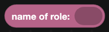 | The role name. |
|  | Its ID. |
|  | Its place in the role list. Higher numbers sit higher. |
|  | Its color, as a hex code. |
|  | When it was created. |
|  | Whether the role has a permission. |

## Giving and taking roles

| Block | What it does |
| --- | --- |
| 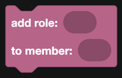 | Gives a role to a member. |
| 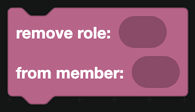 | Takes it away. |
|  | True when a member has the role. |

These three are all an autorole, a reaction role or a level role needs.

## Changing a role

| Block | What it does |
| --- | --- |
| 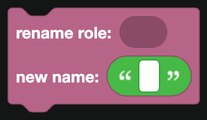 | Renames the role. |
| 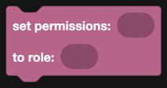 | Replaces the role's permissions with a list. |
| 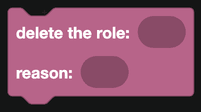 | Deletes the role. |

:::warning
`set permissions` replaces everything, it does not add. To keep the existing permissions, read them first and build a new list that includes them.
:::

## The role hierarchy

Discord will refuse anything that breaks the hierarchy:

- A bot cannot give, take, edit or delete a role that is **above its own highest role**.
- A bot cannot moderate a member whose highest role is above the bot's.

If a role block does nothing, the bot's role is almost always too low. Drag the bot's role higher in Server Settings, Roles.

## Events

For the moment a role is added or removed from a member, see [Member Actions](../Events/member-actions.md).

## A worked example: an autorole

1. `when a member joins a server` from [Server Actions](../Events/server-actions.md).
2. `get the role with the name equal to Member on the server <server the member joined to>`.
3. `add role <that role> to member <member that joined>`.

Store the role ID in a [database](../Databases/simple.md) or a [website dashboard setting](../dashboard.md) so each server can pick its own.
