# Server

Blocks about a whole Discord server: its name, its members, its icon, and its boosts.

  
Show the whole Server flyout

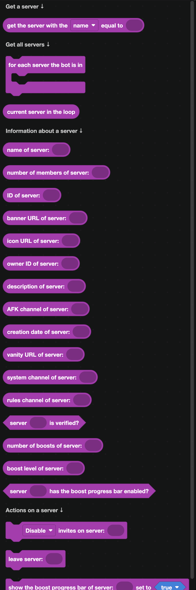

## Getting a server

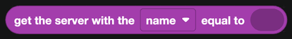

`get the server with the name equal to ...` looks a server up. It also accepts a server ID, which is more reliable, since two servers can share a name.

Most of the time you do not need this block. Event blocks already hand you a server, and interaction blocks have `server of the interaction`.

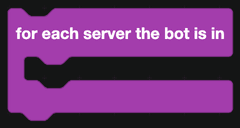

`for each server the bot is in` loops over all of them.

Inside that loop, `current server in the loop` is the one being handled.

## Reading a server

| Block | Returns |
| --- | --- |
| 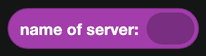 | The server name. |
| 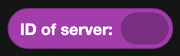 | Its ID. |
| 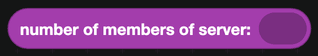 | How many members it has. |
| 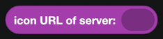 | A URL to the server icon. |
| 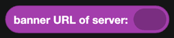 | A URL to the server banner. |
| 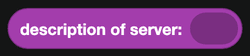 | The server description. |
| 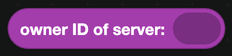 | The owner's user ID. |
| 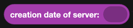 | When the server was created. |
| 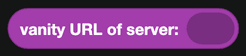 | The custom invite URL, if the server has one. |
|  | Whether Discord has verified the server. |
| 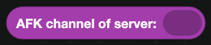 | The AFK voice channel. |
| 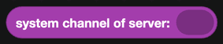 | Where Discord's own join messages go. |
| 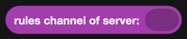 | The rules channel of a community server. |

## Boosts

| Block | Returns |
| --- | --- |
| 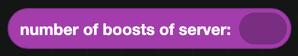 | How many boosts the server has. |
| 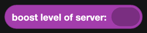 | The boost tier, 0 to 3. |
|  | Whether the boost progress bar is shown. |

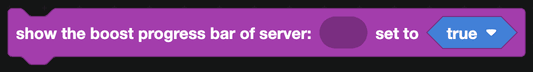

`show the boost progress bar of server` turns that bar on or off.

For events when someone boosts or the level changes, see [Boosts](../Events/boosts.md).

## Actions

| Block | What it does |
| --- | --- |
| 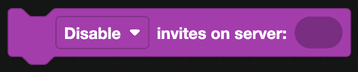 | Pauses all invites to the server. A raid control measure. |
| 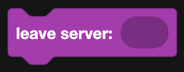 | Makes the bot leave the server. |

:::warning
`leave server` cannot be undone from inside the bot. Somebody has to re-invite it.
:::

## A worked example: a server info command

1. A slash command called `serverinfo`.
2. Build a container with a section that uses `icon URL of server` as its thumbnail.
3. Inside the container, text displays with the name, member count, boost level and creation date.
4. Format the creation date with `create timestamp from date` from [Time](../time.md), so it shows in each viewer's own time zone.
