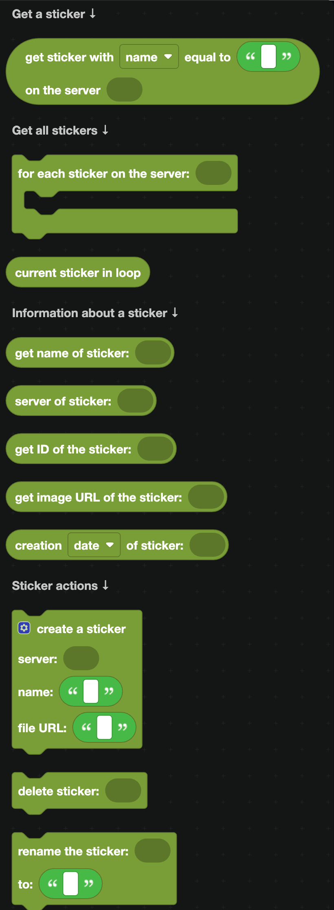
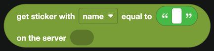
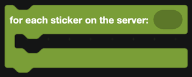
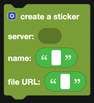
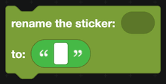
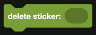

# Stickers

Stickers are the larger images people send from the sticker picker. These blocks read a server's stickers and manage them.

  
Show the whole Stickers flyout

## Getting a sticker

`get sticker with name equal to ... on the server ...` finds one by name or ID.

| Block | What it does |
| --- | --- |
|  | Loops over every sticker in a server. |
|  | The sticker being handled. |

## Reading a sticker

| Block | Returns |
| --- | --- |
|  | The sticker name. |
|  | Its ID. |
|  | A URL to the image. |
|  | The server it belongs to. |
|  | When it was uploaded. |

## Managing stickers

| Block | What it does |
| --- | --- |
|  | Uploads a new sticker from a file URL. |
|  | Renames a sticker. |
|  | Deletes it. |

Creating and deleting stickers needs the **Manage Expressions** permission.

## Sticker limits

| Boost level | Stickers |
| --- | --- |
| None | 5 |
| Level 1 | 15 |
| Level 2 | 30 |
| Level 3 | 60 |

Discord requires stickers to be PNG, APNG or Lottie, exactly 320 by 320 pixels, and under 512 KB. If `create a sticker` fails, the file usually does not meet one of those.

## Events

For when a sticker is created, deleted or renamed, see [Emojis and Stickers](../Events/emojis-stickers.md).
