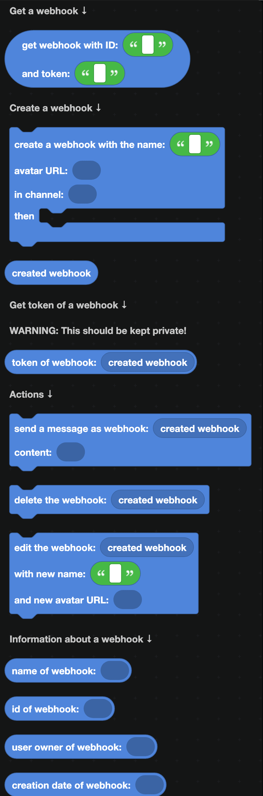
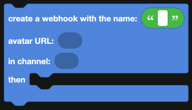
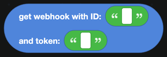
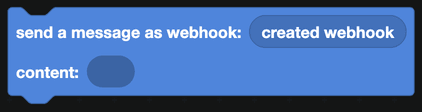
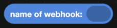
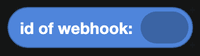
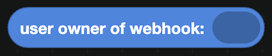
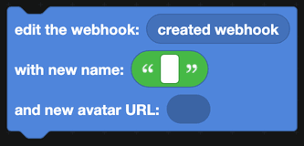

# Webhooks

A webhook posts a message into a channel under any name and avatar you like. It is how a bot can appear as several different characters, and how logging integrations post without needing a bot at all.

  
Show the whole Webhooks flyout

## Creating a webhook

`create a webhook with the name ...` makes one in a channel. Blocks in the `then` part run once it exists.

`created webhook` is the new webhook. Send with it, or store its ID and token so you can use it again later.

## Getting an existing webhook

`get webhook with ID ... and token ...` fetches one you saved earlier. Both parts are needed.

## Sending

`send a message as webhook` posts into the webhook's channel. The message appears under the webhook's name and avatar rather than your bot's.

## Reading a webhook

| Block | Returns |
| --- | --- |
|  | The webhook's display name. |
|  | Its ID. |
|  | The user who created it. |
|  | When it was created. |

`token of webhook` returns the secret half of the webhook.

:::danger
A webhook token lets anyone who has it post into that channel, forever, with no bot and no permissions. Treat it exactly like your bot token: never print it in a message, never write it into a public project, and store it as a [secret](../../Guide/secrets.md) if you need to keep it.
:::

## Managing

| Block | What it does |
| --- | --- |
|  | Changes the webhook's name and avatar. |
|  | Deletes it. Anything holding the token can no longer post. |

## When to use a webhook instead of the bot

- **Impersonating a user**, for example a message proxy or a roleplay bot where each character has its own name and avatar.
- **Logging**, where a distinct name makes the source obvious at a glance.
- **Posting without the bot online**, since a webhook is a URL and does not need your bot running.

For everything else, `send message in channel` from [Channels](channels.md) is simpler. Webhook messages cannot be edited by your bot the way its own messages can, and they cannot carry interaction components your bot answers.

## Notes

- A channel can hold up to 15 webhooks.
- Creating and reading webhooks needs the **Manage Webhooks** permission.
- If a webhook is deleted in Discord, blocks using it stop working. Wrap them in a `try` block from [JavaScript](../javascript.md).
