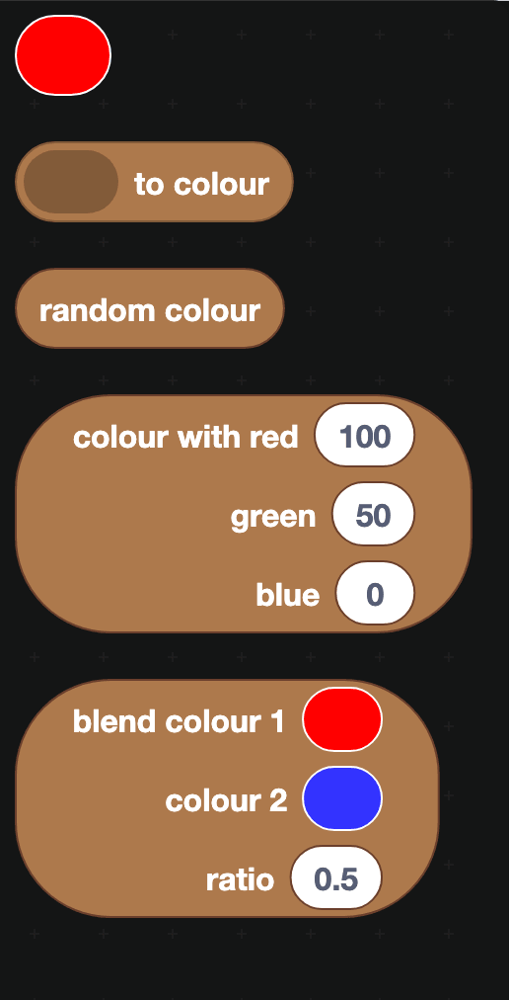
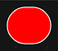
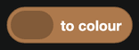
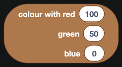
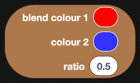

# Colour

Colors are used for container accents, role colors, and anything you draw with the [Canvas](Apps/canvas.md) blocks.

:::note
The category and its blocks are spelled **colour** in the editor, so that is what you are looking for in the toolbox. These docs write "color" everywhere else, and quote the block names as they actually appear.
:::

## The blocks

| Block | What it does |
| --- | --- |
|  | A color you choose from a picker. Click the swatch to open it. |
|  | Turns text or a number into a color, so a hex code from a database or a slash command option can be used as one. |
|  | A different color every time it runs. |
|  | A color built from red, green and blue values, each 0 to 100. |
|  | Mixes two colors. The ratio decides how much of each: 0 is all of the first, 1 is all of the second. |

## Hex codes

Discord and DisFuse both use hex codes, which look like `#5865F2`. The two characters after the `#` are red, the next two green, the last two blue, each from `00` to `FF`.

If you have a hex code as text, `to colour` converts it. If you want the hex code of an existing role or member color, the [Roles](Servers/roles.md) and [Members](Servers/members.md) categories both have blocks that return one.

## Where colors are used

- **Container accent color** on a [container](Components/layout.md) component, which draws the colored bar down the left of the message.
- **Button style** is not a color block. Discord only allows five fixed button styles, so buttons use a dropdown rather than a color.
- **Role color**, when creating a role with the [Roles](Servers/roles.md) blocks.
- **Fill and stroke color** on the [Canvas](Apps/canvas.md) blocks.

:::tip
`random colour` on a container accent gives a message a different feel each time it is sent, which works nicely for fun commands and badly for anything a user needs to recognize at a glance.
:::
