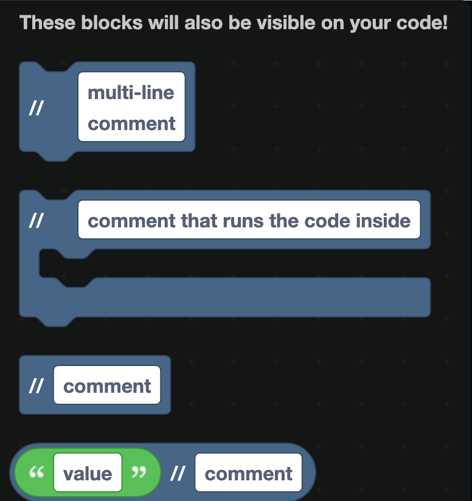
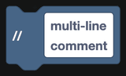
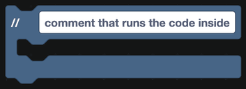
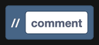
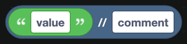

# Comments

Comments are notes for humans. They do nothing when the bot runs, and they appear in the exported code so anyone reading it can follow along.

## The blocks

| Block | Where it goes |
| --- | --- |
|  | In a stack, spanning several lines. |
|  | Wraps a stack of blocks, labeling what they do. |
|  | On its own, anywhere on the canvas. |
|  | In a hole, so a value can carry a note. |

`comment that runs the code inside` is the most useful of the four. It puts a heading on a group of blocks and keeps them visually together, which makes a long event much easier to read.

## Block comments

Separately from these blocks, every block can carry its own note. Right-click a block and choose **Add Comment** to get a small question mark you can click to read and edit. Those notes stay in the project but do not appear in the exported code.

## What to write

Comments that repeat the block are wasted. `// send a message` above a send message block tells nobody anything.

Comments that explain **why** earn their place:

- `// skip bots so the welcome message never fires for another bot`
- `// 86400000 is 24 hours, matching the daily reward cooldown`
- `// stored as JSON because a member has three values, not one`

## Where else notes live

- **Workspace names** describe a whole tab. Naming one "Moderation" is a comment in itself. See [Workspaces](../Guide/workspaces.md).
- **Project description** is what people see on your project page.
- **Version names** in [Version Control](../Guide/version-control.md) record what a snapshot was for.
