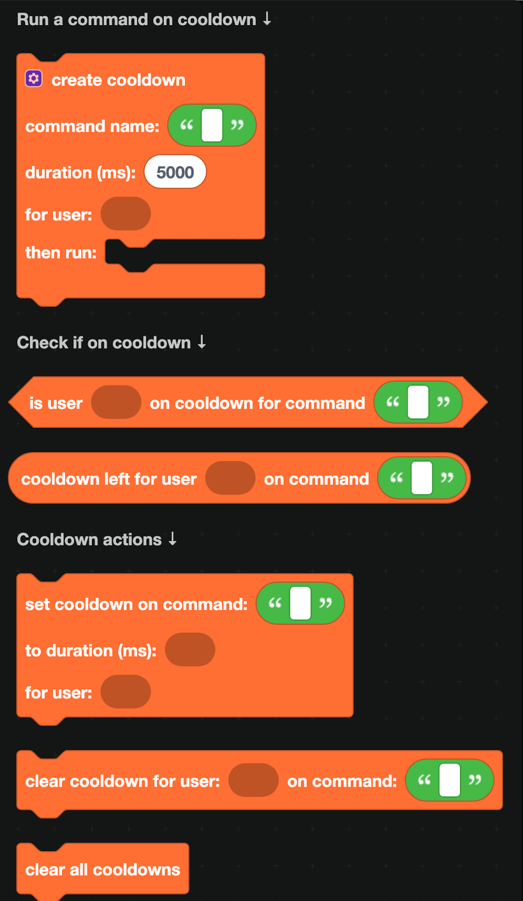
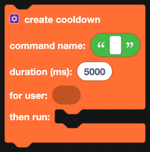
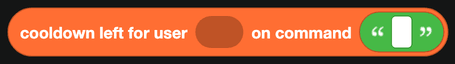
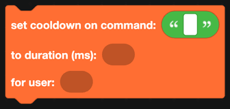
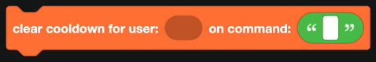

# Cooldowns

A cooldown stops somebody using a command again too soon. Without one, a `/daily` command can be run a hundred times a second, and a command that calls an API will get you rate limited.

## The easy way

`create cooldown` does the whole job in one block. Give it:

| Field | What it is |
| --- | --- |
| Command name | A label for this cooldown. Any text, as long as you use the same one everywhere. |
| Duration (ms) | How long the cooldown lasts, in milliseconds. |
| For user | Who the cooldown applies to. |
| then run | The blocks that only run when the user is not on cooldown. |

If the user is on cooldown, nothing inside `then run` happens. That is usually not enough on its own, because the user gets no feedback, so most commands pair it with the check block below.

## Checking manually

| Block | Returns |
| --- | --- |
|  | True when the user is currently on cooldown for that command. |
|  | How many milliseconds are left. |

The usual pattern is:

1. `if` `is user ... on cooldown for command ...`
2. Reply with how long is left, formatted with `turn milliseconds to time string` from [Time](time.md).
3. `else`, do the work and `set cooldown`.

## Setting and clearing

| Block | What it does |
| --- | --- |
|  | Puts a user on cooldown for a command. |
|  | Ends one user's cooldown for one command. |
|  | Ends every cooldown for everyone. |

`clear cooldown` is useful for an admin command that lets staff reset somebody's daily, or for giving the cooldown back when a command failed halfway through.

## Per user, per server, or global

The "for user" input is just an identifier. Feed it something different and the cooldown means something different:

| Plug in | Effect |
| --- | --- |
| `user of the interaction` | One cooldown per person. |
| `ID of server` | One cooldown for the whole server. |
| A fixed piece of text | One global cooldown for everyone. |
| `create text with` the user ID and the server ID | Per person, per server. |

## Cooldowns are not saved

Cooldowns live in the bot's memory. When the bot restarts, every cooldown is cleared. For a `/daily` command where that matters, store the last-used timestamp in a [database](Databases/simple.md) instead and compare it against the current time.

## A worked example: a daily reward

1. `when a slash command is received`, name is `daily`.
2. `if` `is user <user of the interaction> on cooldown for command daily`:
   - Reply, visible only to the user, with "Come back in " and `cooldown left ...` formatted as a time string.
3. `else`:
   - Add the reward to their balance in the database.
   - `set cooldown on command daily to duration 86400000` (24 hours) for that user.
   - Reply with what they got.
