# Dashboard

Dashboard blocks read and write the settings people configure on your [DisFuse Website](../Features/websites.md). It is how a server owner picks a welcome channel on a web page and your bot uses it, without you writing a settings command.

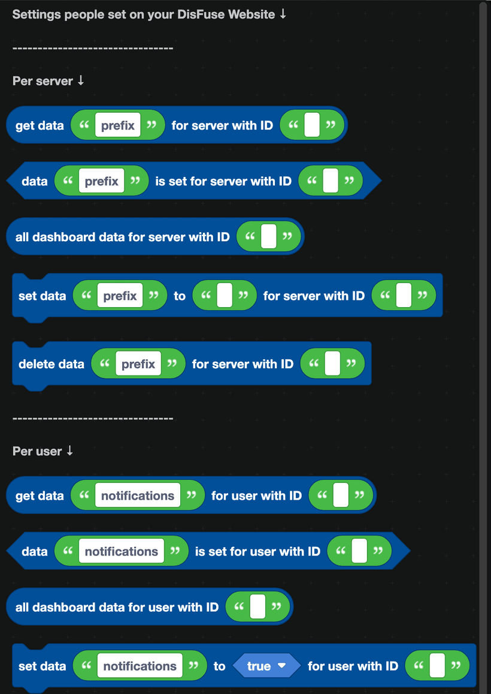

:::info
Dashboard blocks only do something when your bot has a DisFuse Website with dashboard controls on it. Websites are free for every bot.
:::

## Two scopes

Settings are stored in one of two places, and the two never mix.

- **Per server.** Configured by whoever is allowed to manage that server's settings. This is where a welcome channel, a prefix or a mod role belongs.
- **Per user.** Configured by the Discord user themselves, and the same in every server. This is where notification preferences or a favorite color belongs.

## Per server blocks

| Block | What it does |
| --- | --- |
| 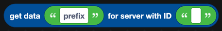 | Reads one setting for a server. |
| 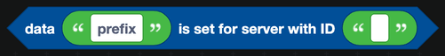 | True when the setting has been configured. |
| 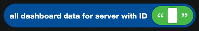 | Every setting for that server, as an object. |
| 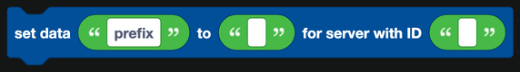 | Writes a setting from inside the bot. |
| 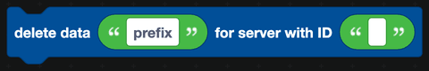 | Removes a setting. |

## Per user blocks

| Block | What it does |
| --- | --- |
| 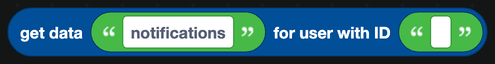 | Reads one setting for a user. |
| 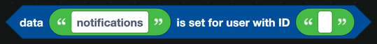 | True when the setting has been configured. |
| 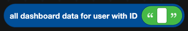 | Every setting for that user, as an object. |
| 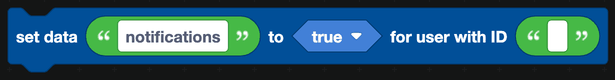 | Writes a setting. |
| 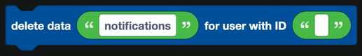 | Removes a setting. |

## Keys

The key in the block has to match the **setting key** you gave the control in the website builder. If your website has a channel picker whose key is `welcome_channel`, that is the exact text you put in `get data ... for server with ID ...`.

Get it wrong and the block returns nothing, with no error. When a setting seems empty, check the key first.

## Defaults

`has data` tells you whether a server has configured a setting at all. Use it so your bot behaves sensibly before anyone visits the dashboard:

1. `if` `data "welcome_channel" is set for server with ID ...`
2. Send the welcome message to that channel.
3. `else`, do nothing, or fall back to the server's system channel.

## Writing from the bot

`set data` lets the bot change a setting itself. This is how a `/setup` command in Discord and the web dashboard can stay in step: both write to the same place.

## Dashboard settings versus the database

| Use | Why |
| --- | --- |
| **Dashboard** for anything a server owner should be able to change without you. | It has a web page, permission checks and validation already built. |
| **[Database](Databases/simple.md)** for data your bot produces. | Balances, XP, warnings and ticket counts are not settings, and nobody should be editing them on a web page. |

## A worked example

A welcome message that each server configures for itself:

1. On your website, add a channel picker with the key `welcome_channel` and a text box with the key `welcome_text`.
2. In `when a member joins a server`:
   - `if` `data "welcome_channel" is set for server with ID <server the member joined to>`
   - `get data "welcome_channel"` gives you the channel ID.
   - `get the channel with the name equal to <that ID>` from [Channels](Servers/channels.md).
   - Send `get data "welcome_text"` into it, with the member's mention added.
