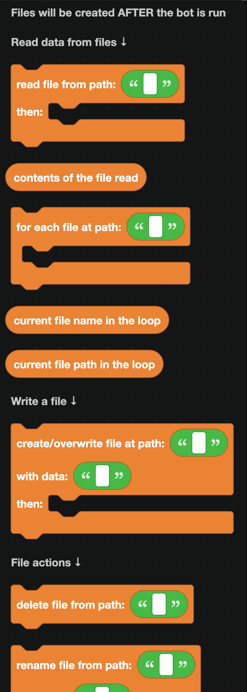
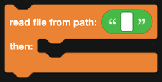
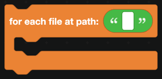
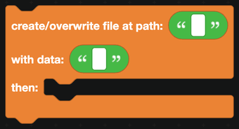
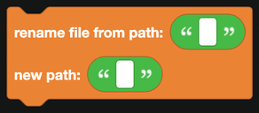

# Files

File blocks read and write files on the machine your bot runs on. Use them for logs, exports, backups, and anything you want to keep as a real file rather than a database key.

  
Show the whole Files flyout

:::info
Files are created when the bot runs, not while you are editing blocks. Nothing appears in your DisFuse project.
:::

## Reading

`read file from path ... then ...` reads a file. Blocks in the `then` part run once it has been read.

Inside that part, `contents of the file read` is the text.

## Listing a folder

`for each file at path ...` loops over the contents of a folder.

| Block | Returns |
| --- | --- |
|  | The name of the current file. |
|  | Its full path. |

## Writing

`create/overwrite file at path ... with data ...` writes a file, replacing it if it already exists. Blocks in the `then` part run afterwards.

To append rather than replace, read the file first, join the old text and the new text with `create text with` from [Text](text.md), and write the result.

## Managing

| Block | What it does |
| --- | --- |
|  | Deletes a file. |
|  | Renames or moves it. |

## Paths

Paths are relative to the folder your bot runs from. `logs/today.txt` means a `logs` folder next to your bot's main file.

Use forward slashes. They work on every operating system, including Windows.

:::warning
Many free hosts wipe the filesystem when a bot restarts, and some make it read only. If your files keep disappearing, that is why. Check whether your host offers persistent storage, or keep the data somewhere else.
:::

## Sending a file to Discord

The [File display](Components/file-display.md) blocks attach a file to a message. `add file from URL/path` accepts a local path, so anything you write with these blocks can be sent straight into a channel.

## Files versus databases

| Use | For |
| --- | --- |
| [Database](Databases/simple.md) | Structured data you look up by key: balances, levels, settings. |
| Files | Whole documents: transcripts, exports, generated images, logs. |

The database is itself a file, so there is no reason to build your own key and value store with these blocks.

## A worked example: a ticket transcript

1. When a ticket thread closes, `get last 100 messages of channel`.
2. Build a piece of text with the author and content of each one.
3. `create/overwrite file at path transcripts/<thread ID>.txt` with that text.
4. In the `then` part, `send message in channel` into your archive channel, with an `add file` block pointing at that path and a `show file` component.
