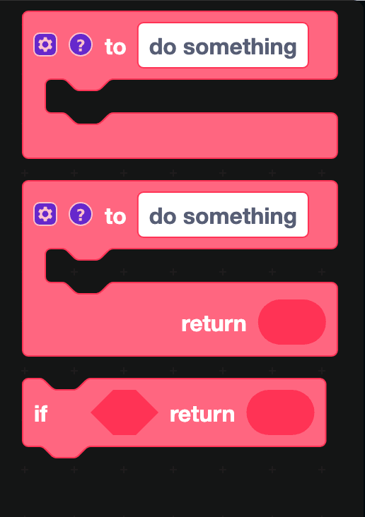
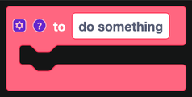
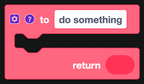
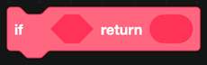

# Functions

A function is a named group of blocks you can run from anywhere. Build a piece of logic once, then call it from every command that needs it.

## The blocks

### to do something

Defines a function that does something but does not hand a value back. Rename it by clicking the name, and put the blocks it should run inside.

Once you have defined it, a matching **call** block appears in the Functions category. Drag that wherever you want the function to run.

### to do something ... return

The same, but it produces a value. The call block for this one is a value block, so it plugs into a hole rather than stacking.

### if ... return

Leaves the function early when a condition is true. Useful for guard checks at the top of a function: if the member is missing, return, and never run the rest.

## Inputs

Click the gear on a function definition to add **inputs**. Each input becomes a hole on the call block and a variable inside the function.

A `logModerationAction` function might take `action`, `target` and `reason` as inputs, so every command that moderates can call it with its own values and get an identically formatted log entry.

## When to make a function

Make a function when you find yourself building the same stack of blocks a second time. Common candidates:

- Sending a formatted error reply
- Writing a mod log entry
- Reading a member's profile out of the database and returning it as an object
- Checking whether a member is staff

## Notes

- Functions belong to the workspace they are defined in. To use the same function in another workspace, define it there too, or keep everything that needs it in one workspace.
- A function cannot be defined inside another block. Definitions sit on their own on the canvas.
- Right-click a call block and choose **Highlight Function Definition** to jump to where it is defined.
