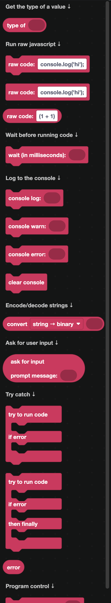
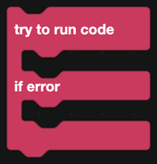
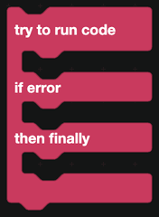
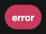
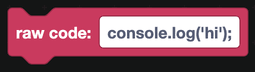
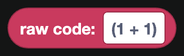

# JavaScript

DisFuse turns your blocks into JavaScript. These blocks let you step outside the block system when you need to: run your own code, wait, log to the console, and handle errors.

  
Show the whole JavaScript flyout

## Waiting

`wait (in milliseconds)` pauses before running the next block. 1,000 milliseconds is one second.

Use it for pacing a sequence of messages, or for cleaning up a temporary message a few seconds after sending it.

## Logging to the console

The console is the black window where your bot's output appears on your host. Nothing here is visible in Discord.

| Block | What it does |
| --- | --- |
|  | Prints a value. |
|  | Prints a value as a warning. |
|  | Prints a value as an error. |
|  | Clears the console. |
|  | Asks whoever is running the bot to type something. |

`console log` is the single most useful debugging tool you have. When a command is not doing what you expect, log the values going into it and watch what actually arrives.

## Handling errors

`try to run code ... if error ...` runs a stack of blocks and, if anything inside them fails, runs the second stack instead of crashing.

The `then finally` version adds a third stack that runs either way.

Inside the `if error` part, the `error` block holds what went wrong. Log it, or show it to yourself in a private channel.

:::tip
Wrap anything that talks to the outside world in a try block: sending a DM to someone who has DMs closed, banning a member with a higher role than the bot, or fetching a URL that might be down. Without it, one failure stops that whole event.
:::

## Raw code

Three blocks let you write JavaScript directly.

| Block | Where it goes |
| --- | --- |
|  | In a stack, as an action. |
|  | On its own, outside any event. Use it for imports or top-level setup. |
|  | In a hole, as a value. |

Your code runs inside a real [discord.js](https://discord.js.org) v14 bot. `client` is the bot, and inside an event block the usual discord.js variables are in scope.

:::warning
Raw code is not checked by DisFuse. A syntax error in one of these blocks stops your whole bot from starting, and the error message will point at the generated file rather than the block. Use **File > Show Code** to see exactly where your code lands.
:::

## Other blocks

| Block | What it does |
| --- | --- |
|  | The type of a value, as text: `string`, `number`, `object` and so on. |
|  | Converts text to binary, or binary back to text. |
|  | Stops the bot process entirely, with an exit code. |

`forcequit` is a hard stop. If you want the bot to disconnect from Discord but keep running, use `shutdown the bot` from [Main](main.md) instead.
