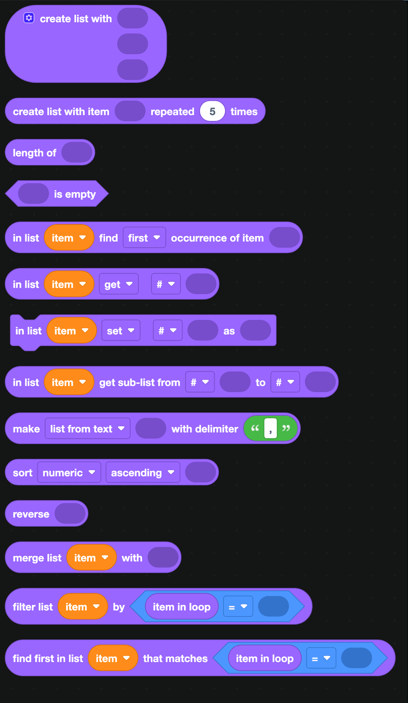
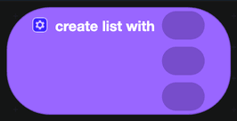
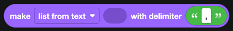

# Lists

A list holds several values in order. Discord blocks hand you lists all the time: the members who reacted to a message, the permissions on a role, the files someone uploaded to a modal.

:::info
Lists in DisFuse start at position 1, not 0. `get # 1` is the first item.
:::

## Making a list

| Block | What it does |
| --- | --- |
|  | Builds a list out of the values you plug in. Click the gear to add more slots. |
|  | Builds a list by repeating one value. |
|  | Splits text into a list on a separator, or joins a list back into text. |
|  | Joins two lists into one. |

## Reading a list

| Block | Returns |
| --- | --- |
|  | How many items the list has. |
|  | True when the list has nothing in it. |
|  | One item, by position. The dropdowns also offer first, last and random. |
|  | The position of an item, or 0 when it is not there. |
|  | A slice of the list. |

## Changing a list

| Block | What it does |
| --- | --- |
|  | Replaces or inserts an item at a position. |
|  | Sorts numerically, alphabetically, or ignoring case, ascending or descending. |
|  | Reverses the order. |

## Searching a list

Two blocks run a test over every item for you.

`filter list ... by` keeps only the items the test says yes to. Inside the test, `item in loop` is the item being checked.

`find first in list ... that matches` returns the first item the test says yes to, and nothing if there is none.

## Looping over a list

Use `for each item in list` from [Loops](loops.md). It gives you each item in turn, which is usually simpler than counting positions yourself.

## Example

To pick a random winner from everyone who reacted to a giveaway message:

1. `get users of reaction ... with emoji 🎉` from [Message](Messages/message.md) gives you a list.
2. `filter` that list, keeping only entries where `is user a bot?` is false.
3. `in list ... get random` picks the winner.
