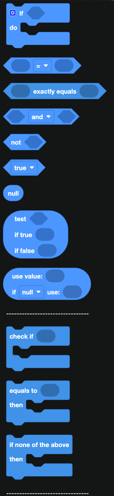
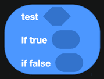
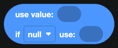
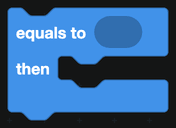
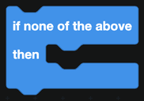

# Logic

Logic blocks let your bot make decisions. Almost every command you write will use at least one of them, usually to check whether something is true before acting.

  
Show the whole Logic flyout

## Making a decision

### if / do

Runs the blocks inside `do` only when the condition plugged into `if` is true.

Click the blue gear on the block to add `else if` and `else` branches:

- **else if** adds another condition, checked only if the ones above it were false.
- **else** runs when none of the conditions matched.

### Ternary

`test ... if true ... if false ...` picks between two values in a single block. Use it when you want a value rather than a branch, for example choosing between the words "member" and "members".

### If null

`use value ... if null use ...` gives you a fallback. If the first value is missing, the second one is used instead. It is the tidiest way to handle a nickname that might not be set, or a database key that does not exist yet.

## Comparisons

The `=` block compares two values. Use the dropdown to switch between `=`, `≠`, `<`, `≤`, `>` and `≥`.

`exactly equals` is stricter: it also requires both sides to be the same type. The text `"5"` equals the number `5`, but it does not exactly equal it. Reach for this one when you are comparing IDs or values that came out of a database.

## Combining conditions

| Block | What it does |
| --- | --- |
|  | `and` is true only when both sides are true. Switch the dropdown to `or` for either side. |
|  | Flips true into false and false into true. |
|  | A plain true or false value. |
|  | Nothing. Use it to check whether something is missing. |

## Switch statements

When you need to compare one value against many possibilities, a switch is easier to read than a stack of `else if` branches.

Put `equals to` blocks inside it, one for each case:

And optionally an `if none of the above` block at the end:

:::tip
A switch is a good fit for a command router: check the name of the slash command once, then give each command its own case.
:::

## Example

A simple permission check before a moderation action:

1. `if` the member running the command **has the permission** Ban Members, ban the target.
2. `else`, reply that they cannot use this command.

The permission check comes from the [Members](Servers/members.md) category, and the reply comes from [Interactions](../Interactions/slash.md).
