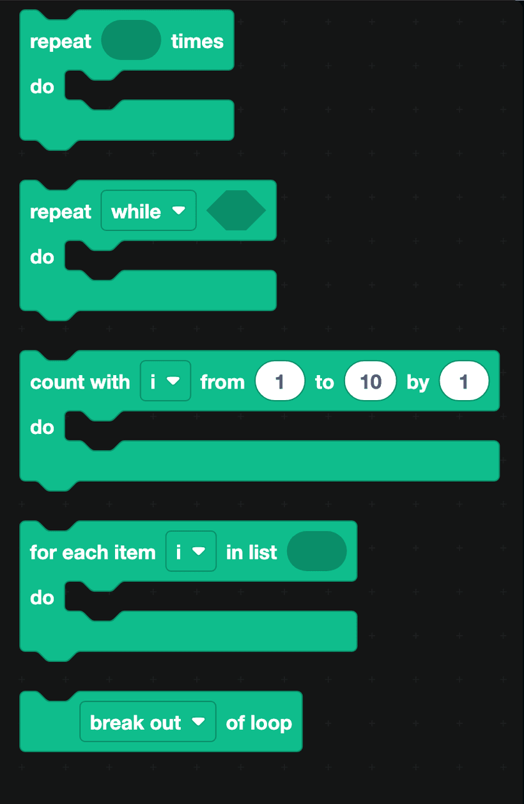
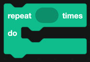
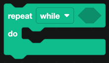
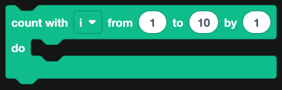
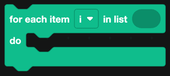

# Loops

Loops repeat a set of blocks. Use them to count, to walk through a list, or to keep going until something changes.

## The loop blocks

### repeat ... times

Runs the blocks inside a fixed number of times.

### repeat while / until

Keeps running for as long as a condition is true, or until it becomes true. Switch between the two with the dropdown.

:::warning
A `while` loop whose condition never becomes false will hang your bot. Make sure something inside the loop changes the value the condition depends on.
:::

### count with

Counts from one number to another, storing the current number in a variable. `count with i from 1 to 10 by 1` gives you 1, 2, 3 and so on up to 10. Change the `by` value to count in steps, or make it negative to count down.

### for each item in list

Runs once for every item in a list, putting the current item in a variable. This is the loop you want whenever you already have a list, such as the results of a database query or a list you built with the [Lists](lists.md) blocks.

### break out of loop

Stops the loop early. Switch the dropdown to `continue with next iteration` to skip the rest of this pass and move on to the next one.

## Discord loops live elsewhere

DisFuse also has loops built for specific Discord objects, and they are in the category they belong to rather than here:

| Loop | Category |
| --- | --- |
| For each member in a server | [Members](Servers/members.md) |
| For each channel in a server | [Channels](Servers/channels.md) |
| For each role in a server, and for each member with a role | [Roles](Servers/roles.md) |
| For each server the bot is in | [Server](Servers/server.md) |
| For each emoji or sticker in a server | [Emojis](Servers/emojis.md), [Stickers](Servers/stickers.md) |
| For each invite | [Invites](Servers/invites.md) |
| For each reaction on a message | [Message](Messages/message.md) |
| For each file in a folder | [Files](files.md) |

Use those rather than fetching a list and looping over it yourself. They handle the fetching for you.

:::tip
Loops that touch Discord are slow, because each pass is a request over the network. Looping over 5,000 members to find one of them will take a long time and may hit Discord's rate limits. If you can look the thing up directly, do that instead.
:::
