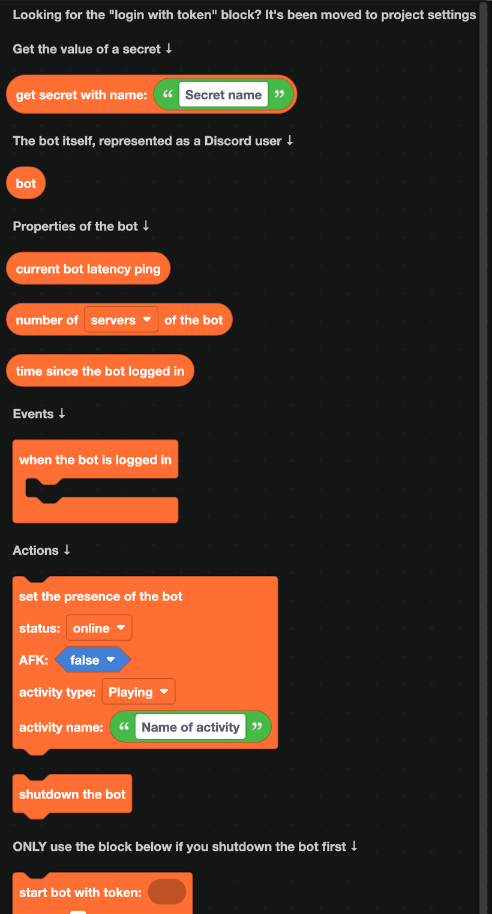
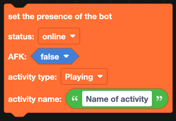
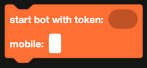

# Main

The Main category holds the bot itself: its secrets, its status, and the event that fires when it comes online.

:::info
Looking for the "log in to bot with token" block? It is gone. Your bot token now lives in **project settings**, so it is never part of your blocks and never appears in an exported file you might share by accident. See [Project settings](../Guide/project-settings.md).
:::

## Secrets

`get secret with name` reads a value out of your project's secrets. Secrets are stored with the project, are only visible to the owner, and are written into a `.env` file when you export.

Use them for anything that should not be readable in your blocks: API keys, database URLs, webhook URLs, or channel IDs you would rather not publish. See [Secrets](../Guide/secrets.md).

## The bot as a user

`bot` is your bot's own Discord user. Plug it into anything that accepts a user, for example to show the bot's own avatar or to check whether a message was sent by the bot.

## Properties

| Block | Returns |
| --- | --- |
|  | The bot's latency to Discord, in milliseconds. |
|  | How many servers the bot is in. |
|  | The time the bot logged in, as a date. |

`current bot latency ping` and `number of servers` are what most `/ping` and `/stats` commands are built from. For uptime, subtract `time since the bot logged in` from the current date with the [Time](time.md) blocks.

## The ready event

`when the bot is logged in` runs once, as soon as your bot connects to Discord. It is where slash commands are registered and where the presence is usually set.

:::warning
Anything that needs Discord to be ready has to go inside this block. Blocks left floating outside it may run before the bot has connected.
:::

## Actions

### Set the presence

Sets the status line under your bot's name. You choose:

- **Status**: online, idle, do not disturb, or invisible
- **AFK**: whether Discord marks the bot as away
- **Activity type**: Playing, Streaming, Listening, Watching, Competing or Custom
- **Activity name**: the text itself

A common pattern is to set the presence inside `when the bot is logged in` and then update it on a timer with the number of servers.

### Shut down and start

| Block | What it does |
| --- | --- |
|  | Disconnects the bot from Discord. The process keeps running. |
|  | Connects again, using a token you provide. |

These are for advanced setups where the bot needs to reconnect deliberately. Only use `start bot with token` after `shutdown the bot`, and take the token from a secret rather than typing it into the block.
