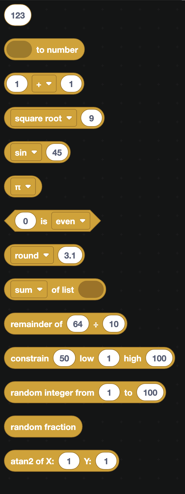
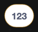
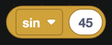
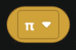

# Math

Math blocks do arithmetic and work with numbers. Economy bots, leveling systems and anything that counts will lean on this category.

  
Show the whole Math flyout

## Numbers and arithmetic

| Block | What it does |
| --- | --- |
|  | A plain number. Type into the box. |
|  | Converts text into a number. Use it on anything that came from a database or a slash command option. |
|  | Add, subtract, multiply, divide, or raise to a power. |
|  | The remainder after dividing. `10 mod 3` is 1. |
|  | Round, round up, or round down. |

:::warning
Values that come back from a database or from a text option are text, even when they look like numbers. Adding `"5"` to `"5"` gives `"55"`, not `10`. Wrap them in `to number` first.
:::

## Random numbers

| Block | What it does |
| --- | --- |
|  | A whole number between two values, both included. |
|  | A number between 0 and 1. |

`random integer from 1 to 100` is the block behind most dice, giveaways and loot drops.

## Working with lists of numbers

`sum of list` adds every number in a list together. The dropdown also offers minimum, maximum, average, median, modes, standard deviation and a random item.

## Checks and limits

| Block | What it does |
| --- | --- |
|  | True when a number is even, odd, prime, whole, positive, negative, or divisible by another number. |
|  | Clamps a number so it never goes below the low value or above the high one. |

`constrain` is useful for keeping a balance from going negative, or keeping a page number inside the range that actually exists.

## Advanced math

| Block | What it does |
| --- | --- |
|  | Square root, absolute value, negation, natural log, log 10, e^, and 10^. |
|  | sin, cos, tan, and their inverses. |
|  | π, e, φ, √2, √½ and infinity. |
|  | The angle from the origin to a point. |

These come into their own with the [Canvas](Apps/canvas.md) blocks, where you might be placing things around a circle.
