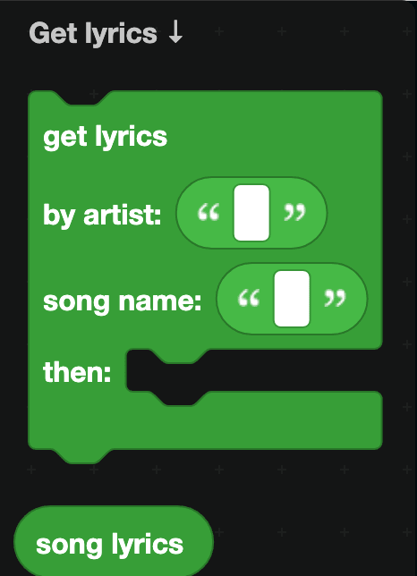
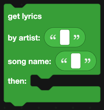

# Music

The Music category has two blocks, for looking up song lyrics.

## Getting lyrics

`get lyrics by artist ... song name ... then ...` looks a song up. Blocks in the `then` part run once the lookup finishes.

Inside that part, `song lyrics` is the text that came back.

## Sending lyrics

Lyrics are often long, and Discord limits a text display to 4,000 characters. Two ways to handle that:

- **Trim.** Use `in text ... get substring from letter 1 to letter 1900` from [Text](text.md) and add a note that the lyrics were shortened.
- **Page.** Split the lyrics into chunks, store them, and give the message Next and Previous [buttons](Components/buttons.md).

## What DisFuse does not do

DisFuse has no blocks for playing audio in a voice channel. Streaming music from a Discord bot needs a voice connection and an audio pipeline, which is beyond what blocks can express.

If you want a music bot, you have two options:

- **Raw JavaScript.** Use the [JavaScript](javascript.md) blocks with `@discordjs/voice` and a player library. You are writing real code at that point, and you will need to add the dependencies to your exported project yourself.
- **Use an existing music bot** alongside yours, and have your bot handle everything else.

## A worked example: a lyrics command

1. A slash command `lyrics` with two text options: `artist` and `song`.
2. `defer reply`, because the lookup takes a moment.
3. `get lyrics by artist <artist option> song name <song option>`.
4. In the `then` part, `edit the bot's reply` with a container holding a text display of the first 1,900 characters.
5. Wrap the lookup in a `try` block from [JavaScript](javascript.md) so a song that cannot be found gives a friendly message rather than a failed interaction.
