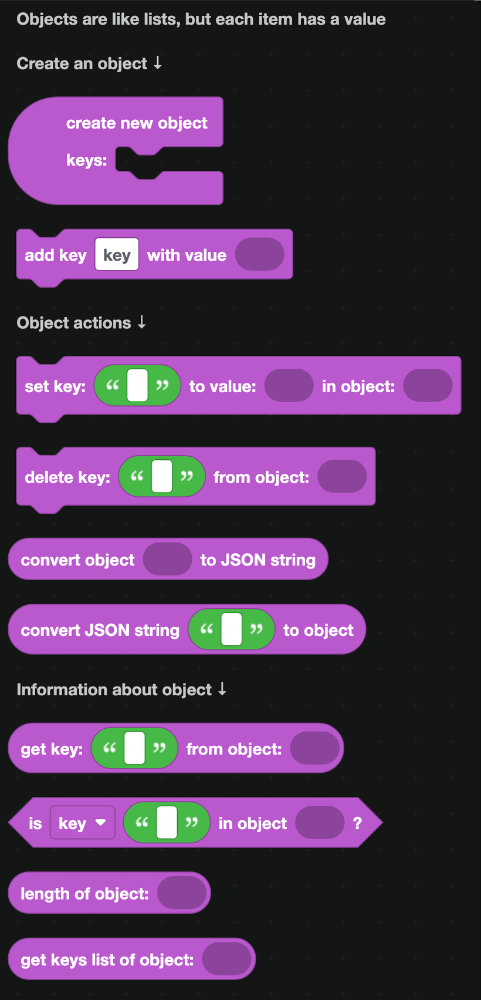
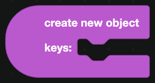
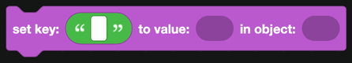

# Objects

An object is like a list where every item has a name instead of a position. Instead of "item 3", you ask for "the balance". Objects are how you store several related values under one database key, and how you read the JSON that comes back from a web request.

## Building an object

`create new object` starts an empty object. Put `add key` blocks inside it, one for each value:

For example, a profile object with the keys `balance`, `level` and `xp`.

## Reading an object

| Block | Returns |
| --- | --- |
|  | The value stored under a key. |
|  | True when the key exists. |
|  | How many keys the object has. |
|  | A list of the key names. |
|  | A list of the values. |

`get key` is the block you will reach for most, especially with the [Fetch](Apps/fetch.md) blocks, where the response data is an object.

## Changing an object

| Block | What it does |
| --- | --- |
|  | Sets a key to a value, adding it if it is not there. |
|  | Removes a key. |

## JSON

JSON is text that describes an object. It is how objects travel over the internet and how they are written into files.

| Block | What it does |
| --- | --- |
|  | Turns an object into JSON text. |
|  | Turns JSON text back into an object. |

Use `convert object to JSON string` before writing an object into a [database](Databases/simple.md) or a [file](files.md), and `convert JSON string to object` when reading it back.

## Nested objects

Keys can hold other objects and lists. To reach into a nested value, chain `get key` blocks: get `data` from the response, then get `user` from that, then get `name` from that.

## Example

Storing a member profile in a database:

1. Build an object with `balance`, `level` and `xp`.
2. `convert object to JSON string`.
3. `set <member ID> to <that text> in the database`.

To read it back, `get <member ID> from the database`, run it through `convert JSON string to object`, then `get key: balance`.
