# Text

Text blocks build and inspect strings. Every message your bot sends, every command name, and every database key is text, so this is one of the categories you will use most.

  
Show the whole Text flyout

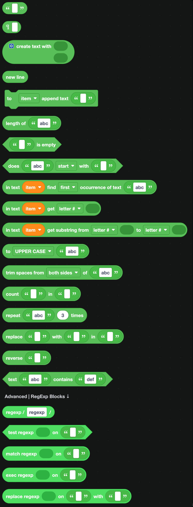

## Creating text

| Block | What it does |
| --- | --- |
| 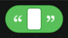 | A plain piece of text. Type into the white box. |
| 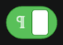 | Text that spans several lines. Click the icon to expand it. |
|  | Joins pieces together. Click the gear to add more slots. |
|  | A line break, for use inside `create text with`. |

`create text with` is how you build a sentence out of a fixed part and a changing part, for example "Welcome to the server, " followed by the member's name.

## Changing text

| Block | What it does |
| --- | --- |
| 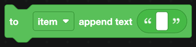 | Adds text onto the end of a variable. |
| 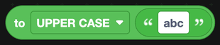 | Converts to UPPER CASE, lower case or Title Case. |
| 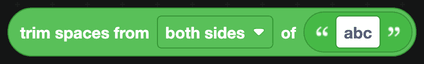 | Removes spaces from the start, the end, or both. |
| 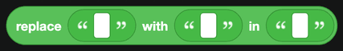 | Replaces every occurrence of one piece of text with another. |
|  | Repeats a piece of text a number of times. |
| 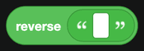 | Turns the text back to front. |
| 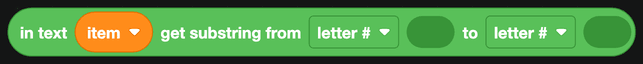 | Takes a slice out of the middle of some text. |
| 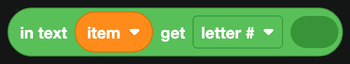 | Gets a single letter by position. |

## Inspecting text

| Block | Returns |
| --- | --- |
| 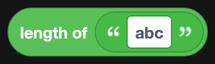 | How many characters the text has. |
|  | True when the text has no characters at all. |
| 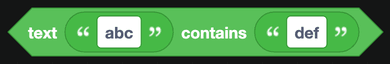 | True when one piece of text appears inside another. |
| 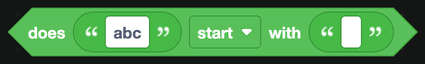 | True when the text starts (or ends) with something. |
| 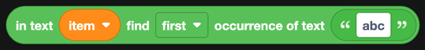 | The position of a piece of text inside another. |
| 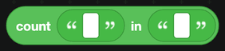 | How many times one piece of text appears in another. |

## Regular expressions

At the bottom of the category are the regular expression blocks. A regular expression is a pattern that describes a shape of text: "a string of digits", "an email address", "a word starting with a capital letter". They are powerful, and they take a little learning.

The `regexp` block holds the pattern itself. Plug it into one of these:

| Block | What it does |
| --- | --- |
| 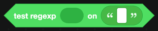 | True when the pattern matches somewhere in the text. |
|  | A list of every part of the text that matched. |
| 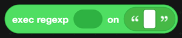 | The first match, plus its capture groups. |
| 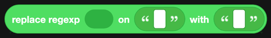 | Replaces everything that matched with something else. |

:::tip
If you are new to regular expressions, [regex101.com](https://regex101.com) explains what a pattern does while you type it.
:::

## A worked example

To detect a Discord invite link in a message and delete it:

1. Use `when a message is received from a human` from [Message](Messages/message.md).
2. Plug `get content of message received` into a `test regexp` block with a pattern like `discord\.gg\/\w+`.
3. If the test is true, use `delete message` and send a warning.
