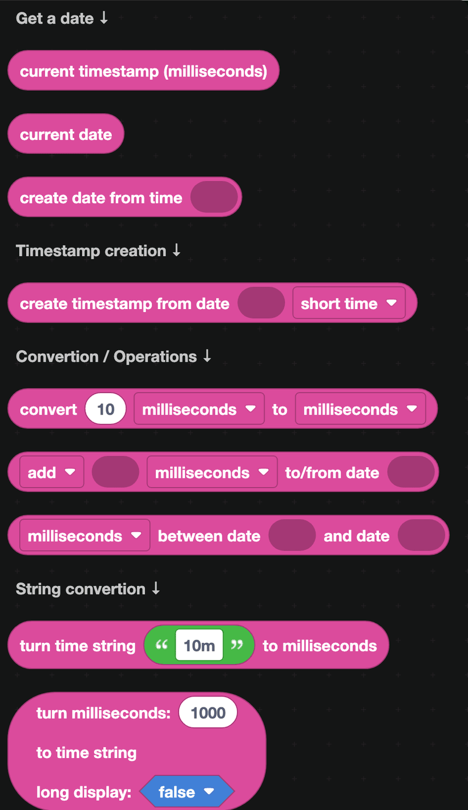
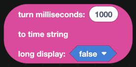

# Time

Time blocks create dates, convert between units, and turn durations into text a person can read. Anything with a cooldown, a ban length, a reminder or an "account created" line uses them.

## Getting a date

| Block | Returns |
| --- | --- |
|  | The current time as a number of milliseconds. |
|  | The current time as a date. |
|  | A date built from a millisecond value. |

A **timestamp** is a plain number: how many milliseconds have passed since the start of 1970. A **date** is a richer value that Discord blocks understand. `create date from time` converts one into the other.

## Discord timestamps

`create timestamp from date` produces the special text Discord renders as a live, local-time timestamp in a message, for example "in 3 hours" or "Today at 14:05". The dropdown picks the style:

| Style | Looks like |
| --- | --- |
| Short time | 14:05 |
| Long time | 14:05:32 |
| Short date | 09/09/2026 |
| Long date | 9 September 2026 |
| Short date and time | 9 September 2026 14:05 |
| Long date and time | Wednesday, 9 September 2026 14:05 |
| Relative | in 3 hours |

This is much better than writing a date yourself, because Discord shows it in each viewer's own time zone.

## Converting and comparing

| Block | What it does |
| --- | --- |
|  | Converts a number between milliseconds, seconds, minutes, hours, days and weeks. |
|  | Adds or subtracts an amount of time from a date. |
|  | How much time separates two dates. |

`milliseconds between date ... and date ...` is how you work out how long ago someone joined, or how long until a ban expires.

## Durations as text

| Block | What it does |
| --- | --- |
|  | Turns text like `10m`, `2h` or `7d` into milliseconds. |
|  | Turns milliseconds into text like `10m` or, with long display on, `10 minutes`. |

These two are what make a `/mute @user 10m` command possible: read the duration as text from the slash command option, convert it with `turn time string to milliseconds`, and pass the result to the timeout block.

## Example

A cooldown message that reads naturally:

1. `cooldown left for user ... on command ...` from [Cooldowns](cooldowns.md) gives you milliseconds.
2. `turn milliseconds to time string` with long display on gives you "2 minutes".
3. Reply with `create text with` "Try again in " and that value.
